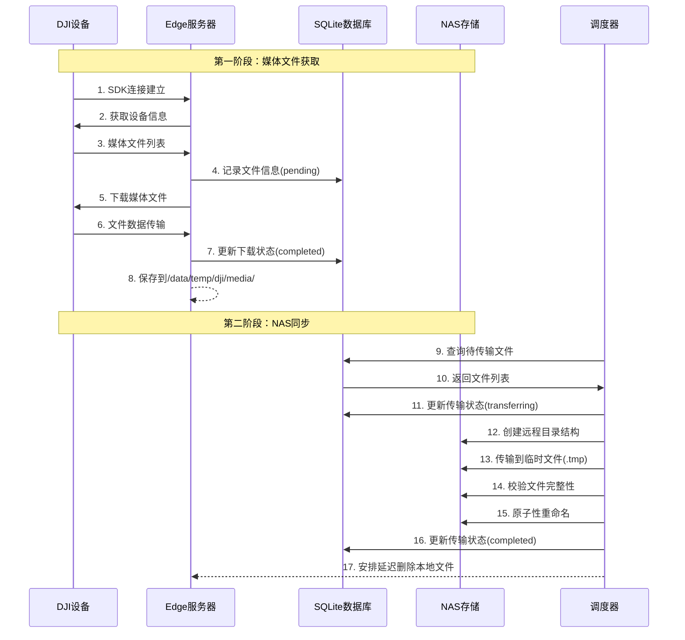

# DJI Edge SDK 媒体文件管理系统 - 工作原理详解

## 系统概览

本系统是一个完整的DJI无人机媒体文件管理解决方案，实现从DJI机场设备到NAS存储的自动化媒体文件传输链路。系统采用两阶段架构设计，确保数据的可靠传输和存储。

### 核心组件架构

```
┌─────────────────┐    ┌──────────────────┐    ┌─────────────────┐
│   DJI 机场设备   │───▶│   边缘服务器      │───▶│   NAS 存储      │
│  (无人机/遥控器) │    │ (Ubuntu 24.04)   │    │ (192.168.200.103)│
└─────────────────┘    └──────────────────┘    └─────────────────┘
        │                       │                       │
        │                       │                       │
    DJI Edge SDK          第一阶段服务              第二阶段服务
   媒体文件获取           dock-info-manager       media-sync-daemon
```

## 系统架构详解

### 1. 第一阶段：媒体文件获取 (dock-info-manager)

**服务位置**: `/etc/systemd/system/dock-info-manager.service`  
**可执行文件**: `/home/celestial/dev/esdk-test/Edge-SDK/celestial_works/bin/dock_info_manager`  
**源代码**: `celestial_works/src/dock_info_manager.cc`

#### 核心功能
1. **SDK初始化**: 使用DJI Edge SDK连接机场设备
2. **设备信息获取**: 获取并记录机场设备详细信息
3. **媒体文件监控**: 实时监控新的媒体文件
4. **文件下载**: 自动下载媒体文件到本地存储
5. **数据库记录**: 维护文件状态和传输记录

#### 关键配置
- **工作目录**: `/home/celestial/dev/esdk-test/Edge-SDK/celestial_works`
- **媒体存储**: `/data/temp/dji/media/`
- **数据库**: `/home/celestial/dev/esdk-test/Edge-SDK/celestial_works/media_status.db`
- **日志路径**: `/home/celestial/dev/esdk-test/Edge-SDK/celestial_works/logs`

### 2. 第二阶段：NAS同步 (media-sync-daemon)

**服务位置**: `/etc/systemd/system/media-sync-daemon.service`  
**主程序**: `celestial_nasops/sync_scheduler.py`  
**核心模块**: `celestial_nasops/media_sync.py`

#### 核心功能
1. **定时同步**: 每10分钟自动执行同步任务
2. **原子性传输**: 使用临时文件确保传输完整性
3. **校验机制**: SHA256校验确保文件完整性
4. **安全删除**: 延迟删除本地文件，确保远程备份成功
5. **存储管理**: 自动清理本地存储空间

#### 关键配置
- **NAS地址**: `192.168.200.103`
- **SSH别名**: `nas-edge` (配置在 `/home/celestial/.ssh/config`)
- **远程路径**: `/volume1/homes/edge_sync/drone_media/EdgeBackup/`
- **同步间隔**: 10分钟
- **重试次数**: 最多3次

## 数据流时序图

### 完整数据流程



### 关键时序节点

1. **T0**: DJI设备产生新媒体文件
2. **T+1min**: dock-info-manager检测到新文件
3. **T+2min**: 文件下载完成，记录到数据库
4. **T+10min**: sync_scheduler执行同步检查
5. **T+12min**: 文件传输到NAS完成
6. **T+42min**: 本地文件安全删除（30分钟延迟）

## 数据库设计

### media_transfer_status 表结构

```sql
CREATE TABLE media_transfer_status (
    id INTEGER PRIMARY KEY AUTOINCREMENT,
    file_path TEXT NOT NULL UNIQUE,           -- 文件完整路径
    file_name TEXT NOT NULL,                  -- 文件名
    file_size INTEGER DEFAULT 0,              -- 文件大小(字节)
    file_hash TEXT DEFAULT '',                -- 文件哈希值
    
    -- 下载状态字段
    download_status TEXT NOT NULL DEFAULT 'pending',
    download_start_time DATETIME,
    download_end_time DATETIME,
    download_retry_count INTEGER DEFAULT 0,
    
    -- 传输状态字段
    transfer_status TEXT NOT NULL DEFAULT 'pending',
    transfer_start_time DATETIME,
    transfer_end_time DATETIME,
    transfer_retry_count INTEGER DEFAULT 0,
    
    -- 错误信息和时间戳
    last_error_message TEXT DEFAULT '',
    created_at DATETIME DEFAULT CURRENT_TIMESTAMP,
    updated_at DATETIME DEFAULT CURRENT_TIMESTAMP
);
```

### 状态流转

```
下载状态: pending → downloading → completed/failed
传输状态: pending → transferring → completed/failed
```

## 配置系统

### 统一配置文件

**位置**: `celestial_nasops/unified_config.json`

```json
{
  "nas_settings": {
    "host": "192.168.200.103",
    "username": "edge_sync",
    "ssh_alias": "nas-edge",
    "base_path": "/volume1/homes/edge_sync/drone_media",
    "backup_path": "EdgeBackup"
  },
  "sync_settings": {
    "interval_minutes": 10,
    "max_retry_attempts": 3,
    "enable_checksum": true,
    "delete_after_sync": true,
    "safe_delete_delay_minutes": 30
  },
  "storage_management": {
    "warning_threshold_percent": 80,
    "critical_threshold_percent": 90,
    "cleanup_target_percent": 70
  }
}
```

### 网络配置

**边缘服务器网络**:
- 主网卡: `eno1` - `192.168.200.55/24`
- Tailscale: `tailscale0` - `100.125.154.79/32`

**SSH配置** (`/home/celestial/.ssh/config`):
```
Host nas-edge
    HostName 192.168.200.103
    User edge_sync
    IdentityFile ~/.ssh/id_ed25519_edge_sync
    IdentitiesOnly yes
    PubkeyAuthentication yes
```

## 文件组织结构

### 本地存储结构
```
/data/temp/dji/media/
├── 20240122_143000.mp4
├── 20240122_143001.jpg
└── 20240122_143002.mp4
```

### NAS存储结构
```
/volume1/homes/edge_sync/drone_media/EdgeBackup/
├── 2024/
│   ├── 01/
│   │   ├── 22/
│   │   │   ├── 20240122_143000.mp4
│   │   │   ├── 20240122_143001.jpg
│   │   │   └── 20240122_143002.mp4
│   │   └── 23/
│   └── 02/
└── 2023/
```

## 关键技术实现

### 1. 原子性文件传输

```python
# 1. 传输到临时文件
temp_filename = f"{filename}.tmp.{timestamp}"
remote_temp_path = f"{remote_dir}{temp_filename}"

# 2. 校验文件完整性
if not self._verify_remote_checksum(remote_temp_path, local_checksum):
    return False

# 3. 原子性重命名
if not self._atomic_rename_remote_file(remote_temp_path, remote_final_path):
    return False
```

### 2. 安全删除机制

```python
# 延迟删除：确保远程文件存在且校验通过后才删除本地文件
self.safe_delete_manager.schedule_delete(
    local_file_path=file_path,
    remote_file_path=remote_file_path,
    local_checksum=local_checksum
)
```

### 3. 并发控制

```python
# 文件锁机制防止多实例同时运行
with SyncLockManager() as lock:
    if lock.acquire():
        # 执行同步操作
        pass
```

## 潜在问题分析

### 1. 网络连接问题

**问题描述**: DJI设备或NAS网络不稳定导致传输失败

**现有机制**:
- 重试机制（最多3次）
- 超时控制（5分钟传输超时）
- 状态记录和恢复

**潜在改进**:
- 增加网络连接检测
- 实现断点续传
- 添加网络质量监控

### 2. 存储空间管理

**问题描述**: 本地存储空间不足影响文件下载

**现有机制**:
- 存储空间监控（80%警告，90%严重）
- 自动清理机制
- 延迟删除策略

**潜在改进**:
- 更智能的清理策略
- 基于文件重要性的优先级删除
- 存储空间预警通知

### 3. 文件完整性验证

**问题描述**: 传输过程中文件损坏或不完整

**现有机制**:
- SHA256校验和验证
- 原子性传输（临时文件+重命名）
- 传输失败重试

**潜在改进**:
- 增加文件大小验证
- 实现分块传输和验证
- 添加传输速度监控

### 4. 服务可靠性

**问题描述**: 系统服务异常停止或崩溃

**现有机制**:
- systemd自动重启（RestartSec=10）
- 启动限制保护（StartLimitBurst=3）
- 详细日志记录

**潜在改进**:
- 健康检查机制
- 服务状态监控和告警
- 自动故障恢复

### 5. 数据库一致性

**问题描述**: 数据库状态与实际文件状态不一致

**现有机制**:
- 事务性操作
- 状态更新触发器
- 定期状态检查

**潜在改进**:
- 数据库备份和恢复
- 状态一致性检查工具
- 数据修复机制

## 监控和维护

### 日志文件位置

- **dock-info-manager**: `/home/celestial/dev/esdk-test/Edge-SDK/celestial_works/logs/`
- **media-sync-daemon**: `/home/celestial/dev/esdk-test/Edge-SDK/celestial_nasops/logs/`
- **系统日志**: `journalctl -u dock-info-manager.service -u media-sync-daemon.service`

### 关键监控指标

1. **服务状态**: `systemctl status dock-info-manager media-sync-daemon`
2. **数据库统计**: 文件下载/传输成功率
3. **存储空间**: 本地和NAS存储使用率
4. **网络连接**: DJI设备和NAS连接状态
5. **错误率**: 传输失败和重试次数

### 维护建议

1. **定期检查**:
   - 每日检查服务运行状态
   - 每周检查存储空间使用情况
   - 每月检查数据库一致性

2. **日志轮转**:
   - 配置日志文件大小限制
   - 定期清理旧日志文件

3. **备份策略**:
   - 定期备份数据库
   - 验证NAS备份完整性

## 总结

本系统通过两阶段架构实现了从DJI设备到NAS的完整媒体文件管理链路，具备以下特点：

1. **可靠性**: 多重校验、重试机制、原子性操作
2. **自动化**: 无人值守的定时同步和清理
3. **可监控**: 详细的日志记录和状态跟踪
4. **可扩展**: 模块化设计，易于功能扩展

系统当前运行稳定，但在网络异常处理、存储管理优化、服务监控等方面仍有改进空间。建议根据实际运行情况，逐步完善相关功能。