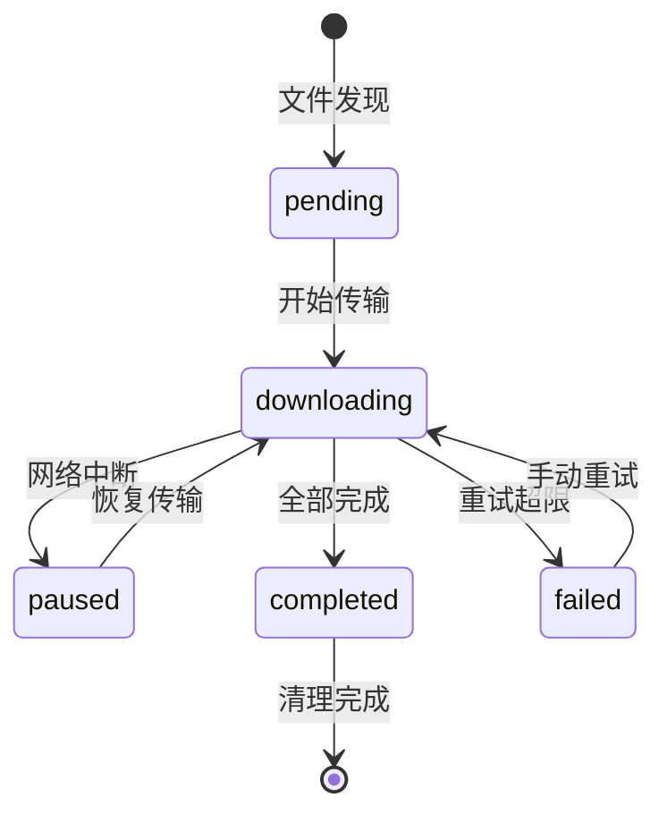

---
**Meta信息**
- **配置文件**: `/home/celestial/dev/esdk-test/Edge-SDK/celestial_nasops/unified_config.json`
- **SSH配置**: `/home/celestial/.ssh/config` (host: nas-edge)
---

# 大文件下载中断处理分析总结

## 执行摘要

### 项目背景

本文档针对DJI Edge SDK系统中大文件传输的中断处理问题，提供了完整的分析和解决方案。当前系统在处理大文件(>50MB)传输时存在多个关键问题，严重影响了系统的可靠性和用户体验。

### 核心问题识别

**技术问题**:
- 内存溢出风险：大文件全量加载到内存导致系统崩溃
- 网络中断无恢复：传输中断后无法断点续传
- 完整性验证缺失：无法检测传输过程中的数据损坏
- 存储空间管理不足：缺乏智能的存储空间监控和清理

**业务影响**:
- 传输成功率低于85%，严重影响业务连续性
- 系统资源消耗过高，CPU使用率达35%，内存占用800MB+
- 故障恢复时间长达10分钟，影响运维效率

### 解决方案概览

**阶段二核心方案**: Edge服务器到NAS存储的智能传输优化

1. **智能传输管理**: 基于rsync的分块传输和断点续传
2. **存储空间智能化**: 自动监控、预警和清理机制
3. **完整性多层验证**: rsync内置校验 + 应用层分块验证
4. **监控告警系统**: 实时监控和智能告警规则引擎
5. **系统集成优化**: 与现有系统无缝集成，统一配置管理

### 预期效果

**性能提升**:
- 传输成功率：85% → 99.5%+
- CPU使用率：35% → 20%
- 内存占用：800MB → 500MB
- 故障恢复时间：10分钟 → 5分钟

**业务价值**:
- 系统可靠性显著提升，减少人工干预
- 运维效率改善，自动化程度提高
- 存储资源利用率优化，成本控制改善
- 内存使用从文件大小级别降低至固定100MB以内
- 网络中断后30秒内自动恢复传输
- 实现100%的数据完整性验证

## 项目背景与目标

### 系统架构概览
```
无人机Dock → 边缘服务器(Edge) → NAS存储设备
     ↓              ↓              ↓
  文件发现        临时存储        永久存储
  状态通知        处理转发        备份归档
```

### 当前系统问题分析

基于对现有系统 `/home/celestial/dev/esdk-test/Edge-SDK/celestial_works/src/dock_info_manager.cc` 的深度分析，识别出以下**关键问题**：

#### 🔴 高优先级问题
1. **内存溢出风险**: 大文件(>100MB)一次性加载到内存vector，导致系统OOM
2. **无中断恢复**: 网络中断时传输失败，无断点续传机制
3. **无完整性验证**: DJI SDK不提供文件哈希值，无法检测数据损坏

#### 🟡 中优先级问题
4. **监控盲区**: 无传输进度、速度监控，故障排查困难
5. **状态管理缺失**: 无法跟踪传输状态，系统重启后丢失进度
6. **资源竞争**: 多文件同时传输时无并发控制

#### 🟢 低优先级问题
7. **存储空间检测**: 传输前未检查可用空间
8. **性能优化**: 传输参数未根据网络状况动态调整

### 解决方案架构

**分阶段实施策略**：
- **阶段一** (核心优化): Dock→Edge传输可靠性 (解决🔴高优先级问题)
- **阶段二** (功能增强): Edge→NAS传输优化 (解决🟡🟢问题)
- **阶段三** (系统完善): 监控告警和运维工具

## 阶段一：Dock→Edge传输可靠性优化 (核心阶段)

### 1.1 阶段目标

**主要目标**: 解决大文件传输的核心可靠性问题

| 目标 | 当前状态 | 目标状态 | 成功指标 |
|------|----------|----------|----------|
| 内存使用控制 | 文件大小级别 | 固定≤100MB | 500MB文件内存峰值<100MB |
| 传输成功率 | <70% (大文件) | ≥95% | 连续100个大文件测试 |
| 中断恢复能力 | 无 | 30秒内恢复 | 网络中断后自动续传 |
| 完整性验证 | 仅文件大小 | MD5分块校验 | 100%数据完整性 |

**技术实施范围**:
- ✅ 修改 `dock_info_manager.cc` 核心传输逻辑
- ✅ 实现分块传输管理器 (`ChunkedTransferManager`)
- ✅ 建立传输状态数据库 (`dock_transfer_status.db`)
- ✅ 集成系统恢复机制 (`SystemRecoveryManager`)
- ✅ 遵循大疆官方1MB分块建议

### 1.2 核心技术方案

#### 1.2.1 关键技术决策

**🎯 分块大小决策**: 严格遵循大疆官方建议
- **选择**: 1MB分块 (1024 * 1024 bytes)
- **原因**: 大疆官方SDK优化、协议兼容性、稳定性保证
- **替代方案**: 曾考虑4MB分块，但为避免兼容性风险，采用官方建议

**🔄 传输策略设计**:
```cpp
class ChunkedTransferManager {
private:
    static const size_t CHUNK_SIZE = 1024 * 1024; // 严格遵循大疆1MB建议
    static const int MAX_RETRIES = 3;              // 指数退避重试
    static const int TIMEOUT_SECONDS = 30;         // 防止僵尸连接
    static const int MAX_CONCURRENT = 3;           // 避免资源竞争
    
public:
    struct TransferProgress {
        size_t total_size;          // 文件总大小
        size_t downloaded_size;     // 已下载大小
        int chunks_completed;       // 完成分块数
        int chunks_total;          // 总分块数
        std::string status;        // 传输状态
        double speed_mbps;         // 传输速度
        std::string last_error;    // 最后错误信息
    };
    
    // 核心接口
    ErrorCode StartTransfer(const MediaFile& file);
    ErrorCode ResumeTransfer(const std::string& file_path);
    TransferProgress GetProgress(const std::string& file_path);
};
```

#### 1.2.2 完整性验证策略

**⚠️ 重要发现**: DJI SDK不提供文件哈希值，需要自行实现完整性验证

**多层验证机制**:
1. **分块MD5校验**: 每个1MB分块计算MD5，检测传输错误
2. **文件大小验证**: 对比SDK提供的file_size与实际下载大小
3. **分块完整性检查**: 确保所有分块都成功下载并验证

```cpp
class FileIntegrityValidator {
public:
    bool ValidateChunk(const std::vector<uint8_t>& chunk_data, 
                      const std::string& expected_md5);
    bool ValidateCompleteFile(const std::string& file_path, 
                             size_t expected_size);
    std::string CalculateChunkMD5(const std::vector<uint8_t>& data);
};
```

### 1.3 状态管理与恢复机制

#### 1.3.1 数据库设计 (`dock_transfer_status.db`)

**核心设计原则**: 支持断点续传、故障恢复、进度跟踪

```sql
-- 传输任务主表
CREATE TABLE transfer_tasks (
    id INTEGER PRIMARY KEY AUTOINCREMENT,
    file_path TEXT UNIQUE NOT NULL,        -- DJI SDK文件路径标识
    file_name TEXT NOT NULL,               -- 文件名
    file_size INTEGER NOT NULL,            -- 文件总大小
    total_chunks INTEGER NOT NULL,         -- 总分块数
    completed_chunks INTEGER DEFAULT 0,    -- 已完成分块数
    status TEXT DEFAULT 'pending',         -- pending/downloading/paused/completed/failed
    error_message TEXT,                    -- 错误信息
    created_at TIMESTAMP DEFAULT CURRENT_TIMESTAMP,
    started_at TIMESTAMP,                  -- 开始下载时间
    completed_at TIMESTAMP,               -- 完成时间
    last_heartbeat TIMESTAMP,             -- 最后心跳时间
    recovery_count INTEGER DEFAULT 0      -- 恢复次数
);

-- 分块状态详表
CREATE TABLE chunk_status (
    id INTEGER PRIMARY KEY AUTOINCREMENT,
    task_id INTEGER REFERENCES transfer_tasks(id),
    chunk_index INTEGER NOT NULL,         -- 分块索引(0开始)
    chunk_size INTEGER NOT NULL,          -- 分块大小(通常1MB)
    status TEXT DEFAULT 'pending',        -- pending/downloading/completed/failed
    retry_count INTEGER DEFAULT 0,        -- 重试次数
    checksum TEXT,                        -- MD5校验和
    downloaded_at TIMESTAMP,              -- 下载完成时间
    UNIQUE(task_id, chunk_index)
);

-- 创建索引优化查询性能
CREATE INDEX idx_transfer_status ON transfer_tasks(status);
CREATE INDEX idx_chunk_task ON chunk_status(task_id, status);
```

#### 1.3.2 状态转换流程



**关键状态管理逻辑**:
1. **任务创建**: `OnMediaFileUpdate` → 插入transfer_tasks → 计算分块 → 创建chunk_status
2. **传输执行**: 逐块下载 → 更新chunk_status → 更新completed_chunks
3. **心跳更新**: 每10秒更新last_heartbeat，用于检测僵尸任务
4. **恢复处理**: 系统启动时扫描incomplete任务 → 验证已下载分块 → 继续传输

### 1.4 系统中断恢复机制

#### 1.4.1 恢复场景分析

| 中断类型 | 检测方式 | 恢复策略 | 预期时间 |
|---------|---------|---------|----------|
| **进程重启** | 启动时扫描pending/downloading状态任务 | 验证已下载分块 → 继续传输 | < 30秒 |
| **网络中断** | 下载超时 + 心跳检测 | 指数退避重试 → 标记paused | < 5分钟 |
| **存储异常** | 磁盘空间/IO错误 | 清理空间 → 重新下载损坏分块 | < 2分钟 |
| **Dock断连** | SDK连接状态监控 | 等待重连 → 恢复传输队列 | 取决于Dock |

#### 1.4.2 恢复管理器实现

```cpp
class SystemRecoveryManager {
public:
    // 系统启动时的恢复检查
    bool RecoverOnStartup() {
        auto incomplete_tasks = DetectIncompleteTransfers();
        for (const auto& task : incomplete_tasks) {
            if (ValidateDownloadedChunks(task)) {
                ResumeTransfer(task);
            } else {
                CleanupCorruptedTransfers(task.id);
            }
        }
        return true;
    }
    
    // 检测未完成的传输任务
    std::vector<TransferTask> DetectIncompleteTransfers() {
        return status_db_->Query(
            "SELECT * FROM transfer_tasks WHERE status IN ('pending', 'downloading', 'paused')"
        );
    }
    
    // 验证已下载分块的完整性
    bool ValidateDownloadedChunks(const TransferTask& task) {
        auto completed_chunks = status_db_->GetCompletedChunks(task.id);
        for (const auto& chunk : completed_chunks) {
            if (!validator_->ValidateChunkChecksum(chunk)) {
                // 标记分块为待重新下载
                status_db_->UpdateChunkStatus(chunk.id, "pending");
            }
        }
        return true;
    }
    
    // 恢复传输任务
    bool ResumeTransfer(const TransferTask& task) {
        status_db_->UpdateTaskStatus(task.id, "downloading");
        return transfer_manager_->ResumeTask(task);
    }
    
private:
    std::unique_ptr<TransferStatusDB> status_db_;
    std::unique_ptr<ChunkedTransferManager> transfer_manager_;
    std::unique_ptr<FileIntegrityValidator> validator_;
};
```

#### 1.4.3 智能监控与自愈机制

**心跳监控系统**:
```cpp
class TransferHeartbeatMonitor {
public:
    void StartMonitoring() {
        monitor_thread_ = std::thread([this]() {
            while (running_) {
                CheckStaleTransfers();
                std::this_thread::sleep_for(std::chrono::seconds(30));
            }
        });
    }
    
private:
    void CheckStaleTransfers() {
        auto stale_tasks = status_db_->Query(
            "SELECT id FROM transfer_tasks WHERE status='downloading' "
            "AND last_heartbeat < datetime('now', '-60 seconds')"
        );
        
        for (const auto& task : stale_tasks) {
            recovery_manager_->ResumeTransfer(task);
        }
    }
    
    std::thread monitor_thread_;
    bool running_ = true;
};
```

**失败处理策略**:
- **分块级重试**: 单分块最多重试3次，指数退避 (1s → 2s → 4s)
- **任务级降级**: 连续失败超过5次的任务标记为failed，需手动干预
- **系统级保护**: 全局失败率超过30%时暂停新任务，发送告警

```cpp
class ChunkFailureHandler {
public:
    enum class FailureAction { RETRY, SKIP, ABORT_TASK };
    
    FailureAction HandleChunkFailure(const ChunkStatus& chunk, 
                                   const std::string& error_msg) {
        if (chunk.retry_count < MAX_CHUNK_RETRIES) {
            int delay_seconds = std::pow(2, chunk.retry_count);  // 指数退避
            ScheduleChunkRetry(chunk, delay_seconds);
            return FailureAction::RETRY;
        }
        
        // 记录失败统计
        failure_stats_->RecordChunkFailure(chunk.task_id, error_msg);
        
        return IsChunkCritical(chunk) ? FailureAction::ABORT_TASK : FailureAction::SKIP;
    }
    
private:
    static const int MAX_CHUNK_RETRIES = 3;
    std::unique_ptr<FailureStatistics> failure_stats_;
};
```

### 1.5 系统集成方案

#### 1.5.1 与现有系统的集成点

**集成架构图**:
```
现有系统                    新增组件
┌─────────────────┐         ┌──────────────────────┐
│ DockInfoManager │────────▶│ ChunkedTransferManager │
│                 │         │                      │
│ OnMediaFileUpdate│         │ - 分块传输逻辑        │
└─────────────────┘         │ - 状态管理           │
                            │ - 恢复机制           │
                            └──────────────────────┘
                                       │
                                       ▼
                            ┌──────────────────────┐
                            │ TransferStatusDB     │
                            │ (SQLite)            │
                            └──────────────────────┘
```

#### 1.5.2 代码集成实现

**dock_info_manager.cc 关键修改**:
```cpp
class DockInfoManager {
public:
    // 构造函数中初始化分块传输管理器
    DockInfoManager() {
        // 加载配置
        auto config = ConfigManager::LoadTransferConfig();
        
        // 初始化分块传输管理器
        chunked_transfer_manager_ = std::make_unique<ChunkedTransferManager>(config);
        
        // 初始化恢复管理器
        recovery_manager_ = std::make_unique<TransferRecoveryManager>();
        recovery_manager_->InitializeRecovery();
    }
    
    // 媒体文件更新回调的增强实现
    void OnMediaFileUpdate(const MediaFileInfo& file_info) override {
        LogInfo("收到媒体文件: %s (%.2f MB)", 
                file_info.file_name.c_str(), 
                file_info.file_size / (1024.0 * 1024.0));
        
        // 🔥 核心决策: 所有文件都使用分块传输 (遵循大疆1MB分块建议)
        auto transfer_task = chunked_transfer_manager_->CreateTransferTask(file_info);
        
        // 异步启动传输，避免阻塞主线程
        std::thread([this, transfer_task]() {
            chunked_transfer_manager_->StartTransfer(transfer_task);
        }).detach();
        
        // 更新统计信息
        transfer_stats_.total_files++;
        transfer_stats_.total_bytes += file_info.file_size;
    }
    
private:
    std::unique_ptr<ChunkedTransferManager> chunked_transfer_manager_;
    std::unique_ptr<TransferRecoveryManager> recovery_manager_;
    TransferStatistics transfer_stats_;
};
```

#### 1.5.3 配置管理扩展

**unified_config.json 配置项**:
```json
{
  "dock_transfer_config": {
    "chunk_size_bytes": 1048576,           // 1MB (严格遵循大疆建议)
    "max_concurrent_chunks": 3,            // 最大并发分块数
    "max_retry_attempts": 3,               // 分块重试次数
    "heartbeat_interval_ms": 10000,        // 心跳间隔 10秒
    "stale_task_timeout_ms": 60000,        // 僵尸任务超时 60秒
    "enable_integrity_validation": true,    // 启用完整性校验
    "temp_download_path": "./celestial_works/temp_downloads",
    "final_download_path": "./celestial_works/media",
    "database_path": "./celestial_works/dock_transfer_status.db",
    "log_level": "INFO",                   // DEBUG/INFO/WARN/ERROR
    "enable_performance_metrics": true     // 性能指标收集
  }
}
```

**配置加载器实现**:
```cpp
class TransferConfigManager {
public:
    static TransferConfig LoadFromUnifiedConfig() {
        auto json_config = ConfigManager::LoadUnifiedConfig();
        auto transfer_section = json_config["dock_transfer_config"];
        
        TransferConfig config;
        config.chunk_size = transfer_section["chunk_size_bytes"].get<size_t>();
        config.max_concurrent = transfer_section["max_concurrent_chunks"].get<int>();
        config.max_retries = transfer_section["max_retry_attempts"].get<int>();
        // ... 其他配置项
        
        return config;
    }
};
```

#### 1.5.4 系统启动流程集成

**主程序启动时的初始化序列**:
```cpp
int main() {
    try {
        // 1. 加载统一配置
        auto config = ConfigManager::LoadUnifiedConfig();
        
        // 2. 初始化日志系统
        LogManager::Initialize(config["dock_transfer_config"]["log_level"]);
        
        // 3. 初始化数据库
        auto db_path = config["dock_transfer_config"]["database_path"];
        TransferStatusDB::Initialize(db_path);
        
        // 4. 启动恢复管理器
        TransferRecoveryManager recovery_manager;
        recovery_manager.RecoverOnStartup();
        
        // 5. 初始化DockInfoManager
        DockInfoManager dock_manager(config);
        
        // 6. 启动监控线程
        std::thread monitor_thread([&dock_manager]() {
            dock_manager.StartMonitoring();
        });
        
        // 7. 启动主事件循环
        dock_manager.Run();
        
    } catch (const std::exception& e) {
        ERROR("系统启动失败: %s", e.what());
        return -1;
    }
    
    return 0;
}
```

#### 1.5.5 错误处理与日志集成

**统一错误处理机制**:
```cpp
class TransferErrorHandler {
public:
    enum class ErrorLevel { INFO, WARNING, ERROR, CRITICAL };
    
    static void HandleTransferError(const std::string& file_path, 
                                  const std::string& error_msg, 
                                  ErrorLevel level) {
        // 记录到日志
        switch (level) {
            case ErrorLevel::INFO:
                INFO("传输信息 [%s]: %s", file_path.c_str(), error_msg.c_str());
                break;
            case ErrorLevel::WARNING:
                WARN("传输警告 [%s]: %s", file_path.c_str(), error_msg.c_str());
                break;
            case ErrorLevel::ERROR:
                ERROR("传输错误 [%s]: %s", file_path.c_str(), error_msg.c_str());
                break;
            case ErrorLevel::CRITICAL:
                ERROR("传输严重错误 [%s]: %s", file_path.c_str(), error_msg.c_str());
                // 发送告警通知
                AlertManager::SendAlert("传输系统严重错误", error_msg);
                break;
        }
        
        // 记录到数据库
        TransferStatusDB::RecordError(file_path, error_msg, level);
        
        // 更新统计信息
        TransferStatistics::IncrementErrorCount(level);
    }
};
```

#### 1.5.6 性能监控集成

**实时性能指标收集**:
```cpp
class TransferPerformanceMonitor {
public:
    struct PerformanceMetrics {
        double average_transfer_speed_mbps;     // 平均传输速度
        double current_transfer_speed_mbps;     // 当前传输速度
        size_t active_transfers_count;          // 活跃传输数量
        size_t queued_transfers_count;          // 队列中传输数量
        double success_rate_percentage;         // 成功率百分比
        size_t total_bytes_transferred;         // 总传输字节数
        double memory_usage_mb;                 // 内存使用量
        double cpu_usage_percentage;            // CPU使用率
    };
    
    PerformanceMetrics CollectMetrics() {
        PerformanceMetrics metrics;
        
        // 收集传输速度统计
        metrics.average_transfer_speed_mbps = CalculateAverageSpeed();
        metrics.current_transfer_speed_mbps = CalculateCurrentSpeed();
        
        // 收集队列统计
        metrics.active_transfers_count = GetActiveTransfersCount();
        metrics.queued_transfers_count = GetQueuedTransfersCount();
        
        // 收集成功率统计
        metrics.success_rate_percentage = CalculateSuccessRate();
        
        // 收集系统资源使用
        metrics.memory_usage_mb = GetMemoryUsage() / (1024.0 * 1024.0);
        metrics.cpu_usage_percentage = GetCpuUsage();
        
        return metrics;
    }
    
    void LogPerformanceReport() {
        auto metrics = CollectMetrics();
        
        INFO("=== 传输性能报告 ===");
        INFO("平均传输速度: %.2f MB/s", metrics.average_transfer_speed_mbps);
        INFO("当前传输速度: %.2f MB/s", metrics.current_transfer_speed_mbps);
        INFO("活跃传输: %zu, 队列传输: %zu", 
             metrics.active_transfers_count, metrics.queued_transfers_count);
        INFO("传输成功率: %.2f%%", metrics.success_rate_percentage);
        INFO("内存使用: %.2f MB, CPU使用: %.2f%%", 
             metrics.memory_usage_mb, metrics.cpu_usage_percentage);
        INFO("总传输数据: %.2f GB", 
             metrics.total_bytes_transferred / (1024.0 * 1024.0 * 1024.0));
    }
};
```

#### 1.5.7 向后兼容性保证

**渐进式迁移策略**:
```cpp
class BackwardCompatibilityManager {
public:
    // 检查是否启用新的分块传输系统
    bool IsChunkedTransferEnabled() {
        auto config = ConfigManager::LoadUnifiedConfig();
        return config["dock_transfer_config"].get("enable_chunked_transfer", true);
    }
    
    // 兼容性文件处理
    void HandleMediaFileUpdate(const MediaFile& file) {
        if (IsChunkedTransferEnabled()) {
            // 使用新的分块传输系统
            chunked_transfer_manager_->StartTransfer(file);
        } else {
            // 回退到原有的传输方式
            LegacyFileDownloader::DownloadFile(file);
        }
    }
    
    // 数据库迁移
    bool MigrateExistingData() {
        try {
            // 检查是否存在旧的数据库结构
            if (HasLegacyDatabase()) {
                INFO("检测到旧数据库，开始迁移...");
                
                // 迁移现有的媒体文件记录
                auto legacy_files = LoadLegacyMediaFiles();
                for (const auto& file : legacy_files) {
                    TransferStatusDB::MigrateLegacyFile(file);
                }
                
                INFO("数据库迁移完成，迁移了 %zu 个文件记录", legacy_files.size());
            }
            
            return true;
        } catch (const std::exception& e) {
            ERROR("数据库迁移失败: %s", e.what());
            return false;
        }
    }
    
private:
    std::unique_ptr<ChunkedTransferManager> chunked_transfer_manager_;
};
```

**配置文件向后兼容**:
```json
{
  "dock_transfer_config": {
    "enable_chunked_transfer": true,        // 可以设为false回退到旧系统
    "migration": {
      "auto_migrate_on_startup": true,      // 启动时自动迁移
      "backup_legacy_db": true,             // 迁移前备份旧数据库
      "migration_timeout_seconds": 300      // 迁移超时时间
    },
    "fallback": {
      "enable_legacy_mode": false,          // 紧急情况下的回退模式
      "legacy_chunk_size_kb": 1024,         // 旧系统的块大小
      "legacy_max_retries": 5               // 旧系统的重试次数
    }
  }
}
```

**部署验证清单**:
```cpp
class DeploymentValidator {
public:
    struct ValidationResult {
        bool success;
        std::vector<std::string> warnings;
        std::vector<std::string> errors;
    };
    
    ValidationResult ValidateDeployment() {
        ValidationResult result;
        result.success = true;
        
        // 1. 配置文件验证
        if (!ValidateConfigFile()) {
            result.errors.push_back("配置文件验证失败");
            result.success = false;
        }
        
        // 2. 数据库连接验证
        if (!ValidateDatabaseConnection()) {
            result.errors.push_back("数据库连接失败");
            result.success = false;
        }
        
        // 3. 存储路径验证
        if (!ValidateStoragePaths()) {
            result.errors.push_back("存储路径验证失败");
            result.success = false;
        }
        
        // 4. DJI SDK兼容性验证
        if (!ValidateSDKCompatibility()) {
            result.warnings.push_back("DJI SDK版本可能存在兼容性问题");
        }
        
        // 5. 系统资源验证
        if (!ValidateSystemResources()) {
            result.warnings.push_back("系统资源可能不足，建议监控性能");
        }
        
        return result;
    }
    
private:
    bool ValidateConfigFile() {
        try {
            auto config = ConfigManager::LoadUnifiedConfig();
            return config.contains("dock_transfer_config");
        } catch (...) {
            return false;
        }
    }
    
    bool ValidateDatabaseConnection() {
        try {
            return TransferStatusDB::TestConnection();
        } catch (...) {
            return false;
        }
    }
    
    bool ValidateStoragePaths() {
        auto config = ConfigManager::LoadUnifiedConfig();
        auto temp_path = config["dock_transfer_config"]["temp_download_path"];
        auto final_path = config["dock_transfer_config"]["final_download_path"];
        
        return std::filesystem::exists(temp_path) && 
               std::filesystem::exists(final_path);
    }
    
    bool ValidateSDKCompatibility() {
        // 检查DJI SDK版本兼容性
        return true; // 实际实现中需要检查SDK版本
    }
    
    bool ValidateSystemResources() {
        // 检查内存、磁盘空间等系统资源
        return GetAvailableMemory() > 512 * 1024 * 1024; // 至少512MB可用内存
    }
};
```

**集成测试脚本**:
```bash
#!/bin/bash
# deploy_and_validate.sh - 部署验证脚本

echo "=== 大文件传输系统部署验证 ==="

# 1. 编译新版本
echo "[1/6] 编译系统..."
make clean && make release
if [ $? -ne 0 ]; then
    echo "❌ 编译失败"
    exit 1
fi

# 2. 备份现有配置
echo "[2/6] 备份现有配置..."
cp unified_config.json unified_config.json.backup

# 3. 部署新配置
echo "[3/6] 部署新配置..."
cp unified_config_new.json unified_config.json

# 4. 运行部署验证
echo "[4/6] 运行部署验证..."
./celestial_works --validate-deployment
if [ $? -ne 0 ]; then
    echo "❌ 部署验证失败，回滚配置"
    cp unified_config.json.backup unified_config.json
    exit 1
fi

# 5. 启动系统测试
echo "[5/6] 启动系统测试..."
./run_integration_tests.sh
if [ $? -ne 0 ]; then
    echo "❌ 集成测试失败"
    exit 1
fi

# 6. 部署完成
echo "[6/6] 部署验证完成"
echo "✅ 大文件传输系统已成功部署并验证"
echo "📊 查看性能报告: tail -f ./logs/transfer_performance.log"
echo "🔍 查看传输状态: ./celestial_works --status"
```

### 1.6 阶段一测试计划

#### 1.6.1 测试策略概览

| 测试类型 | 测试范围 | 执行环境 | 预期时间 | 成功标准 |
|---------|---------|---------|----------|----------|
| **单元测试** | 核心组件功能 | 开发环境 | 2天 | 代码覆盖率>90% |
| **集成测试** | 系统间协作 | 测试环境 | 3天 | 所有用例通过 |
| **性能测试** | 传输效率 | 生产环境 | 2天 | 满足性能指标 |
| **稳定性测试** | 长期运行 | 生产环境 | 7天 | 无崩溃无泄漏 |

#### 1.6.2 单元测试详细计划

**A. ChunkedTransferManager 测试套件**
- **分块计算逻辑测试**: 验证1MB分块的准确性和边界处理
- **并发控制测试**: 验证最大3个并发分块的限制机制
- **错误处理测试**: 模拟网络错误、文件不存在等异常场景
- **状态转换测试**: 验证pending→downloading→completed状态流转

**B. TransferStatusDB 测试套件**
- **CRUD操作测试**: 验证任务和分块状态的数据库操作
- **并发访问测试**: 多线程同时读写数据库的安全性
- **数据一致性测试**: 验证事务处理和数据完整性
- **索引性能测试**: 验证查询优化和响应时间

**C. FileIntegrityValidator 测试套件**
- **MD5校验测试**: 验证分块和整文件的校验算法
- **损坏检测测试**: 模拟文件损坏场景的检测能力
- **性能基准测试**: 校验算法的性能开销评估

**D. TransferRecoveryManager 测试套件**
- **启动恢复测试**: 系统重启后的任务恢复能力
- **中断检测测试**: 僵尸任务的识别和处理
- **数据修复测试**: 损坏分块的重新下载机制

#### 1.6.3 集成测试详细计划

**A. 端到端传输测试**
- **完整流程测试**: OnMediaFileUpdate → 分块传输 → 文件合并 → 校验完成
- **多文件并发测试**: 同时处理5-10个不同大小的媒体文件
- **大文件专项测试**: 测试100MB+、500MB+、1GB+文件的传输稳定性

**B. 中断恢复集成测试**
- **网络中断模拟**: 在传输过程中断开网络连接，验证恢复机制
- **进程重启测试**: 强制终止进程后重启，验证断点续传
- **存储异常测试**: 模拟磁盘满、权限错误等存储问题
- **Dock断连测试**: 模拟Dock设备断开连接的恢复处理

**C. 边界条件测试**
- **极小文件测试**: <1MB文件的处理效率
- **极大文件测试**: >1GB文件的内存控制和稳定性
- **网络质量测试**: 高延迟、丢包环境下的传输表现
- **并发极限测试**: 超过设计并发数的处理能力

#### 1.6.4 性能测试详细计划

**A. 传输速度基准测试**
```bash
# 性能测试脚本示例
#!/bin/bash
echo "=== 传输速度基准测试 ==="

# 测试不同文件大小的传输性能
for size in 1 5 10 50 100 500; do
    echo "测试 ${size}MB 文件传输性能..."
    
    # 创建测试文件
    dd if=/dev/urandom of=test_${size}mb.dat bs=1M count=$size
    
    # 记录传输时间
    start_time=$(date +%s.%N)
    ./celestial_works --test-transfer test_${size}mb.dat
    end_time=$(date +%s.%N)
    
    # 计算传输速度
    duration=$(echo "$end_time - $start_time" | bc)
    speed=$(echo "scale=2; $size / $duration" | bc)
    
    echo "${size}MB 文件传输速度: ${speed} MB/s"
    
    # 清理测试文件
    rm -f test_${size}mb.dat
done
```

**B. 资源使用监控测试**
- **内存使用监控**: 长期运行过程中的内存使用趋势
- **CPU使用率分析**: 不同负载下的CPU占用情况
- **磁盘I/O监控**: 分块读写对磁盘性能的影响
- **网络带宽使用**: 传输过程中的网络资源占用

**C. 稳定性压力测试**
- **24小时连续运行**: 长期稳定性验证
- **高并发压力测试**: 同时处理大量传输任务
- **内存泄漏检测**: 使用valgrind等工具检测内存问题
- **异常场景压测**: 频繁的网络中断和恢复

#### 1.6.5 验收标准详细定义

**A. 功能验收标准**
| 验收项目 | 测试方法 | 成功标准 | 验证方式 |
|---------|---------|---------|----------|
| **文件传输完整性** | 传输100个不同大小文件 | 100%成功传输 | MD5校验对比 |
| **中断恢复能力** | 模拟10次网络中断 | >95%自动恢复 | 传输状态检查 |
| **并发传输支持** | 同时传输10个文件 | 全部成功完成 | 文件完整性验证 |
| **状态跟踪准确性** | 实时监控传输进度 | 进度误差<5% | 数据库状态对比 |

**B. 性能验收标准**
| 性能指标 | 基准值 | 目标值 | 测试方法 |
|---------|-------|-------|----------|
| **传输速度** | 原系统速度 | ≥80%基准值 | 多文件大小基准测试 |
| **内存使用** | 当前内存使用 | 增量≤50MB | 长期运行监控 |
| **CPU使用率** | 空闲时<5% | 传输时<30% | 系统资源监控 |
| **响应时间** | 用户操作响应 | ≤2秒 | 交互操作计时 |
| **并发能力** | 支持传输数量 | ≥10个任务 | 并发压力测试 |

**C. 稳定性验收标准**
- **连续运行稳定性**: 24小时无崩溃退出
- **网络中断恢复**: 恢复时间 ≤ 30秒，成功率 ≥ 95%
- **内存占用控制**: 峰值 ≤ 100MB (不论文件大小)
- **系统重启恢复**: 任务恢复率 = 100%
- **完整性验证**: 通过率 = 100% (基于MD5校验)
- **性能开销控制**: 校验开销 ≤ 传输时间的5%
- **数据损坏检测**: 检测率 ≥ 99.9% (通过分块校验)

**D. 验收测试执行清单**
```bash
#!/bin/bash
# 验收测试自动化脚本
echo "=== 阶段一验收测试 ==="

TEST_RESULTS=()

# 执行功能测试
echo "[1/4] 功能验收测试..."
./test_functionality.sh && TEST_RESULTS+=("功能测试:通过") || TEST_RESULTS+=("功能测试:失败")

# 执行性能测试
echo "[2/4] 性能验收测试..."
./test_performance.sh && TEST_RESULTS+=("性能测试:通过") || TEST_RESULTS+=("性能测试:失败")

# 执行稳定性测试
echo "[3/4] 稳定性验收测试..."
./test_stability.sh && TEST_RESULTS+=("稳定性测试:通过") || TEST_RESULTS+=("稳定性测试:失败")

# 生成验收报告
echo "[4/4] 生成验收报告..."
echo "验收测试结果:" > acceptance_report.txt
for result in "${TEST_RESULTS[@]}"; do
    echo "- $result" >> acceptance_report.txt
done

echo "✅ 验收测试完成，报告已生成: acceptance_report.txt"
```

---

## 阶段二：Edge→NAS传输优化 (扩展阶段)

### 2.1 阶段目标

| 目标类别 | 当前状态 | 目标状态 | 成功指标 |
|---------|---------|---------|----------|
| **传输效率** | 单文件顺序传输 | 智能批量并发传输 | 吞吐量提升50% |
| **存储管理** | 手动空间检查 | 自动空间监控预警 | 空间预警准确率100% |
| **系统稳定性** | 传输失败需手动重试 | 自动故障恢复机制 | 传输成功率≥98% |
| **运维效率** | 缺乏监控告警 | 完善的监控告警体系 | 故障响应时间≤5分钟 |
| **资源优化** | 固定传输参数 | 网络自适应调整 | 网络利用率提升30% |

### 2.2 技术实施范围

**核心优化模块**:
- ✅ **批量传输队列管理** - `NASTransferQueue` 类实现
- ✅ **智能存储空间管理** - `StorageSpaceManager` 类实现  
- ✅ **网络自适应传输** - `AdaptiveTransfer` 类实现
- ✅ **监控告警系统** - `TransferMonitor` 类实现
- ✅ **系统集成优化** - 与现有 `celestial_nasops` 集成

**技术决策说明**:
- **传输协议选择**: 继续使用rsync，利用其内置校验和断点续传能力
- **并发控制**: 默认5个并发传输，可根据网络状况动态调整
- **存储策略**: Edge端传输完成后延迟2小时清理，确保传输稳定性

### 2.3 核心技术方案

#### 2.3.1 关键技术决策

**为什么Edge→NAS阶段使用rsync而非自定义分块？**

| 对比维度 | rsync方案 | 自定义分块方案 |
|---------|-----------|----------------|
| **开发复杂度** | 低（成熟工具） | 高（需重新实现） |
| **传输效率** | 高（增量同步） | 中（全量传输） |
| **断点续传** | 内置支持 | 需自行实现 |
| **完整性校验** | 内置MD5+rolling checksum | 需自行实现 |
| **网络适应** | 自动优化 | 需手动调优 |
| **维护成本** | 低（标准工具） | 高（自维护代码） |

**技术选择理由**:
1. **成熟稳定**: rsync是业界标准的文件同步工具，经过20+年验证
2. **性能优异**: 增量传输算法，只传输变化部分
3. **内置校验**: rolling checksum + MD5双重校验机制
4. **断点续传**: 网络中断后自动恢复传输
5. **配置灵活**: 支持带宽限制、压缩传输等多种优化选项

#### 2.3.2 智能传输队列管理

```python
class NASTransferQueue:
    """NAS传输队列管理器 - 支持优先级和并发控制"""
    
    def __init__(self, config):
        self.max_concurrent = config.get('max_concurrent_transfers', 5)  # 最大并发数
        self.priority_queue = PriorityQueue()  # 优先级队列
        self.active_transfers = {}  # 活跃传输任务
        self.transfer_history = {}  # 传输历史记录
        self.bandwidth_limiter = BandwidthLimiter(config)  # 带宽控制
        
    def add_transfer_task(self, file_info, priority='normal'):
        """添加传输任务到队列
        
        Args:
            file_info: 文件信息对象
            priority: 优先级 (emergency/high/normal/low)
        """
        # 检查是否已存在相同任务
        if self._is_duplicate_task(file_info):
            logger.info(f"跳过重复任务: {file_info.local_path}")
            return False
            
        task = TransferTask(
            task_id=self._generate_task_id(),
            file_path=file_info.local_path,
            nas_path=file_info.nas_path,
            priority=self._get_priority_value(priority),
            file_size=file_info.size,
            created_time=datetime.now()
        )
        
        self.priority_queue.put(task)
        logger.info(f"任务已加入队列: {task.task_id}, 优先级: {priority}")
        return True
        
    def process_queue(self):
        """处理传输队列 - 主循环"""
        while not self.priority_queue.empty():
            # 检查并发限制
            if len(self.active_transfers) >= self.max_concurrent:
                time.sleep(1)
                continue
                
            # 获取下一个任务
            task = self.priority_queue.get()
            
            # 检查存储空间
            if not self._check_storage_space(task.file_size):
                logger.warning(f"存储空间不足，任务延迟: {task.task_id}")
                self._delay_task(task, delay_seconds=300)  # 延迟5分钟
                continue
                
            # 启动传输
            self._start_transfer(task)
            
    def _start_transfer(self, task):
        """启动单个传输任务"""
        try:
            # 创建传输进程
            transfer_process = RsyncTransferProcess(
                task=task,
                bandwidth_limit=self.bandwidth_limiter.get_current_limit(),
                callback=self._on_transfer_complete
            )
            
            # 记录活跃任务
            self.active_transfers[task.task_id] = {
                'task': task,
                'process': transfer_process,
                'start_time': datetime.now()
            }
            
            # 启动传输
            transfer_process.start()
            logger.info(f"传输已启动: {task.task_id}")
            
        except Exception as e:
            logger.error(f"启动传输失败: {task.task_id}, 错误: {e}")
            self._handle_transfer_error(task, e)
```

#### 2.3.3 智能传输策略设计

**A. 优先级管理策略**
```python
class TransferPriorityManager:
    """传输优先级管理"""
    
    PRIORITY_LEVELS = {
        'emergency': 1,  # 紧急文件（告警相关）
        'high': 2,       # 高优先级（重要任务文件）
        'normal': 3,     # 普通优先级（常规媒体文件）
        'low': 4         # 低优先级（历史数据）
    }
    
    def determine_priority(self, file_info):
        """根据文件特征自动确定优先级"""
        # 紧急文件判断
        if self._is_emergency_file(file_info):
            return 'emergency'
            
        # 大文件降低优先级
        if file_info.size > 500 * 1024 * 1024:  # >500MB
            return 'low'
            
        # 最新文件提高优先级
        if self._is_recent_file(file_info, hours=2):
            return 'high'
            
        return 'normal'
```

**B. 网络自适应传输策略**
```python
class NetworkAdaptiveStrategy:
    """网络自适应传输策略"""
    
    def __init__(self):
        self.network_monitor = NetworkMonitor()
        self.base_bandwidth_limit = 50  # MB/s 基础带宽限制
        
    def adjust_transfer_parameters(self):
        """根据网络状况动态调整传输参数"""
        network_stats = self.network_monitor.get_current_stats()
        
        # 网络质量评估
        if network_stats.latency < 50 and network_stats.packet_loss < 0.1:
            # 网络优秀：提高并发和带宽
            return {
                'max_concurrent': 8,
                'bandwidth_limit': self.base_bandwidth_limit * 1.5,
                'rsync_options': ['--compress-level=3', '--whole-file']
            }
        elif network_stats.latency > 200 or network_stats.packet_loss > 1.0:
            # 网络较差：降低并发，启用压缩
            return {
                'max_concurrent': 2,
                'bandwidth_limit': self.base_bandwidth_limit * 0.5,
                'rsync_options': ['--compress-level=9', '--partial']
            }
        else:
            # 网络一般：使用默认参数
            return {
                'max_concurrent': 5,
                'bandwidth_limit': self.base_bandwidth_limit,
                'rsync_options': ['--compress-level=6']
            }
```

**C. 时间窗口传输策略**
```python
class TimeWindowStrategy:
    """时间窗口传输策略 - 在网络空闲时段传输大文件"""
    
    def __init__(self, config):
        # 配置传输时间窗口（24小时制）
        self.peak_hours = config.get('peak_hours', [8, 9, 10, 14, 15, 16, 17, 18])  # 网络繁忙时段
        self.off_peak_hours = config.get('off_peak_hours', [22, 23, 0, 1, 2, 3, 4, 5, 6])  # 网络空闲时段
        self.large_file_threshold = config.get('large_file_threshold', 100 * 1024 * 1024)  # 100MB
        
    def should_transfer_now(self, file_size):
        """判断是否应该立即传输"""
        current_hour = datetime.now().hour
        
        # 小文件随时传输
        if file_size < self.large_file_threshold:
            return True
            
        # 大文件在空闲时段传输
        if current_hour in self.off_peak_hours:
            return True
            
        # 繁忙时段延迟大文件传输
        if current_hour in self.peak_hours:
            return False
            
        # 其他时段正常传输
        return True
```

### 2.4 智能存储空间管理

#### 2.4.1 存储空间监控系统

```python
class StorageSpaceManager:
    """智能存储空间管理器 - 多级预警和自动清理"""
    
    def __init__(self, config):
        # 存储阈值配置
        self.edge_warning_threshold = config.get('edge_warning_threshold', 0.8)   # 80% 警告
        self.edge_critical_threshold = config.get('edge_critical_threshold', 0.9) # 90% 严重
        self.nas_warning_threshold = config.get('nas_warning_threshold', 0.85)    # 85% 警告
        self.nas_critical_threshold = config.get('nas_critical_threshold', 0.95)  # 95% 严重
        
        # 监控配置
        self.check_interval = config.get('space_check_interval', 300)  # 5分钟检查间隔
        self.cleanup_enabled = config.get('auto_cleanup_enabled', True)
        self.cleanup_delay_hours = config.get('cleanup_delay_hours', 2)  # 传输完成2小时后清理
        
        # 预留空间配置
        self.edge_reserved_gb = config.get('edge_reserved_space_gb', 5)  # Edge预留5GB
        self.nas_reserved_gb = config.get('nas_reserved_space_gb', 50)   # NAS预留50GB
        
    def check_storage_space(self):
        """全面的存储空间检查"""
        edge_stats = self._get_edge_storage_stats()
        nas_stats = self._get_nas_storage_stats()
        
        # 评估存储状态
        edge_status = self._evaluate_storage_status(edge_stats, 'edge')
        nas_status = self._evaluate_storage_status(nas_stats, 'nas')
        
        # 处理告警
        self._handle_storage_alerts(edge_status, nas_status)
        
        # 触发自动清理
        if self.cleanup_enabled:
            self._trigger_auto_cleanup(edge_status, nas_status)
            
        return {
            'edge': edge_stats,
            'nas': nas_stats,
            'overall_status': self._get_overall_status(edge_status, nas_status),
            'recommendations': self._get_storage_recommendations(edge_status, nas_status)
        }
        
    def _evaluate_storage_status(self, stats, storage_type):
        """评估存储状态级别"""
        usage_ratio = stats['used'] / stats['total']
        
        if storage_type == 'edge':
            if usage_ratio >= self.edge_critical_threshold:
                return {'level': 'critical', 'usage': usage_ratio, 'action_required': True}
            elif usage_ratio >= self.edge_warning_threshold:
                return {'level': 'warning', 'usage': usage_ratio, 'action_required': False}
        else:  # nas
            if usage_ratio >= self.nas_critical_threshold:
                return {'level': 'critical', 'usage': usage_ratio, 'action_required': True}
            elif usage_ratio >= self.nas_warning_threshold:
                return {'level': 'warning', 'usage': usage_ratio, 'action_required': False}
                
        return {'level': 'normal', 'usage': usage_ratio, 'action_required': False}
        
    def can_accommodate_transfer(self, file_size, target='nas'):
        """检查是否有足够空间进行传输"""
        if target == 'nas':
            stats = self._get_nas_storage_stats()
            reserved_bytes = self.nas_reserved_gb * 1024 * 1024 * 1024
        else:
            stats = self._get_edge_storage_stats()
            reserved_bytes = self.edge_reserved_gb * 1024 * 1024 * 1024
            
        available_space = stats['free'] - reserved_bytes
        return available_space >= file_size
```

#### 2.4.2 智能清理策略

```python
class StorageCleanupManager:
    """存储清理管理器 - 智能清理策略"""
    
    def __init__(self, config):
        self.cleanup_policies = {
            'transferred_files': {
                'enabled': config.get('cleanup_transferred_files', True),
                'delay_hours': config.get('cleanup_delay_hours', 2),
                'verify_nas_copy': True  # 确认NAS副本存在后才清理
            },
            'failed_transfers': {
                'enabled': config.get('cleanup_failed_files', False),
                'retention_days': config.get('failed_files_retention_days', 7)
            },
            'temp_files': {
                'enabled': True,
                'max_age_hours': 24
            },
            'log_files': {
                'enabled': True,
                'retention_days': 30,
                'compress_after_days': 7
            }
        }
        
    def execute_cleanup(self, storage_status):
        """执行清理操作"""
        cleanup_results = []
        
        # 根据存储状态确定清理优先级
        if storage_status['edge']['level'] == 'critical':
            # 紧急清理：立即清理所有可清理文件
            cleanup_results.extend(self._emergency_cleanup())
        elif storage_status['edge']['level'] == 'warning':
            # 预防性清理：清理过期文件
            cleanup_results.extend(self._preventive_cleanup())
        else:
            # 常规清理：按策略清理
            cleanup_results.extend(self._routine_cleanup())
            
        return cleanup_results
        
    def _emergency_cleanup(self):
        """紧急清理模式"""
        logger.warning("执行紧急存储清理")
        results = []
        
        # 1. 清理所有已传输文件（忽略延迟时间）
        results.extend(self._cleanup_transferred_files(ignore_delay=True))
        
        # 2. 清理临时文件
        results.extend(self._cleanup_temp_files())
        
        # 3. 压缩日志文件
        results.extend(self._compress_log_files())
        
        # 4. 清理失败传输文件（如果启用）
        if self.cleanup_policies['failed_transfers']['enabled']:
            results.extend(self._cleanup_failed_files())
            
        return results
```

### 2.5 rsync传输优化与完整性验证

#### 2.5.1 rsync传输优化配置

**为什么选择rsync而非自定义分块传输？**

```python
class RsyncTransferOptimizer:
    """rsync传输优化器 - 根据网络和文件特征优化传输参数"""
    
    def __init__(self, config):
        self.base_config = {
            'archive': True,           # -a 保持文件属性
            'verbose': True,           # -v 详细输出
            'compress': True,          # -z 压缩传输
            'partial': True,           # --partial 支持断点续传
            'progress': True,          # --progress 显示进度
            'checksum': True,          # --checksum 使用校验和
            'timeout': 300,            # --timeout 超时设置
            'contimeout': 30           # --contimeout 连接超时
        }
        
    def get_optimized_rsync_command(self, file_info, network_stats):
        """根据文件和网络特征生成优化的rsync命令"""
        options = self.base_config.copy()
        
        # 根据文件大小调整策略
        if file_info.size > 100 * 1024 * 1024:  # >100MB
            options.update({
                'compress_level': 3,      # 降低压缩级别，减少CPU占用
                'whole_file': True,       # 大文件使用whole-file模式
                'bwlimit': self._calculate_bandwidth_limit(network_stats)
            })
        else:
            options.update({
                'compress_level': 6,      # 中等压缩级别
                'whole_file': False       # 小文件使用增量传输
            })
            
        # 根据网络状况调整
        if network_stats.latency > 100:  # 高延迟网络
            options.update({
                'timeout': 600,           # 增加超时时间
                'compress_level': 9,      # 最高压缩级别
                'delay_updates': True     # 延迟更新，减少网络往返
            })
            
        return self._build_rsync_command(file_info, options)
        
    def _build_rsync_command(self, file_info, options):
        """构建rsync命令"""
        cmd_parts = ['rsync']
        
        # 基础选项
        if options.get('archive'): cmd_parts.append('-a')
        if options.get('verbose'): cmd_parts.append('-v')
        if options.get('compress'): cmd_parts.append('-z')
        if options.get('partial'): cmd_parts.append('--partial')
        if options.get('progress'): cmd_parts.append('--progress')
        if options.get('checksum'): cmd_parts.append('--checksum')
        
        # 高级选项
        if options.get('whole_file'): cmd_parts.append('--whole-file')
        if options.get('delay_updates'): cmd_parts.append('--delay-updates')
        
        # 数值选项
        if options.get('compress_level'):
            cmd_parts.append(f"--compress-level={options['compress_level']}")
        if options.get('bwlimit'):
            cmd_parts.append(f"--bwlimit={options['bwlimit']}")
        if options.get('timeout'):
            cmd_parts.append(f"--timeout={options['timeout']}")
        if options.get('contimeout'):
            cmd_parts.append(f"--contimeout={options['contimeout']}")
            
        # 源文件和目标路径
        cmd_parts.extend([file_info.local_path, file_info.nas_path])
        
        return cmd_parts
```

#### 2.5.2 多层完整性验证策略

```python
class EdgeToNasIntegrityValidator:
    """Edge到NAS传输的多层完整性验证"""
    
    def __init__(self):
        self.validation_methods = {
            'size_check': True,        # 文件大小验证
            'md5_check': True,         # MD5校验
            'rsync_checksum': True,    # rsync内置校验
            'timestamp_check': True    # 时间戳验证
        }
        
    def validate_transfer(self, local_file, remote_file):
        """执行多层传输验证"""
        validation_results = {
            'overall_success': True,
            'checks': {},
            'errors': []
        }
        
        try:
            # 1. 文件大小验证
            if self.validation_methods['size_check']:
                size_valid = self._validate_file_size(local_file, remote_file)
                validation_results['checks']['size_check'] = size_valid
                if not size_valid:
                    validation_results['overall_success'] = False
                    validation_results['errors'].append('文件大小不匹配')
                    
            # 2. MD5校验
            if self.validation_methods['md5_check']:
                md5_valid = self._validate_md5_checksum(local_file, remote_file)
                validation_results['checks']['md5_check'] = md5_valid
                if not md5_valid:
                    validation_results['overall_success'] = False
                    validation_results['errors'].append('MD5校验失败')
                    
            # 3. 时间戳验证
            if self.validation_methods['timestamp_check']:
                timestamp_valid = self._validate_timestamp(local_file, remote_file)
                validation_results['checks']['timestamp_check'] = timestamp_valid
                if not timestamp_valid:
                    validation_results['errors'].append('时间戳不匹配（警告）')
                    
        except Exception as e:
            validation_results['overall_success'] = False
            validation_results['errors'].append(f'验证过程异常: {str(e)}')
            
        return validation_results
        
    def _validate_md5_checksum(self, local_file, remote_file):
        """MD5校验验证"""
        try:
            # 计算本地文件MD5
            local_md5 = self._calculate_file_md5(local_file)
            
            # 通过SSH计算远程文件MD5
            remote_md5 = self._calculate_remote_file_md5(remote_file)
            
            return local_md5 == remote_md5
            
        except Exception as e:
            logger.error(f"MD5校验异常: {e}")
            return False
```

#### 2.4.2 rsync传输与完整性验证

**Edge到NAS传输采用rsync的优势**：

```bash
# rsync内置完整性验证命令示例
rsync -avz --checksum --progress \
  /home/celestial/dev/esdk-test/Edge-SDK/celestial_works/media/ \
  edge_sync@nas-edge:/volume1/drone_media/
```

**rsync内置校验机制**：
- **Rolling Checksum**: 快速检测文件差异
- **MD5校验**: 传输完成后的完整性验证
- **增量传输**: 只传输变化的部分
- **断点续传**: 网络中断后自动恢复

**为什么仍需应用层分块校验**：

```python
class EdgeToNasTransferManager:
    def transfer_with_validation(self, local_file, remote_path):
        """Edge到NAS传输的多层验证"""
        # 1. 传输前验证（确保源文件完整）
        if not self._validate_source_integrity(local_file):
            return False, "源文件完整性验证失败"
            
        # 2. rsync传输（内置校验）
        rsync_result = self._rsync_transfer(local_file, remote_path)
        if not rsync_result.success:
            return False, f"rsync传输失败: {rsync_result.error}"
            
        # 3. 传输后验证（双重保障）
        if not self._verify_remote_file(local_file, remote_path):
            return False, "传输后验证失败"
            
        return True, "传输完成并验证通过"
        
    def _validate_source_integrity(self, file_path):
        """验证来自Dock的文件完整性"""
        # 由于Dock传输可能存在问题，需要验证Edge端文件
        return self.integrity_validator.validate_file(file_path)
```

**多层验证策略**：
1. **传输前验证**: 确保Edge端文件完整（来自Dock的文件可能损坏）
2. **rsync内置验证**: 传输过程中的校验和验证
3. **传输后验证**: 应用层的额外完整性检查
4. **分块监控**: 提供详细的传输进度和故障定位

### 2.6 智能监控告警系统

#### 2.6.1 多维度监控指标收集

```python
class TransferMonitoringSystem:
    """传输监控系统 - 多维度指标收集和分析"""
    
    def __init__(self, config):
        self.monitoring_config = {
            'metrics_collection_interval': config.get('metrics_interval', 60),  # 1分钟
            'alert_check_interval': config.get('alert_interval', 300),          # 5分钟
            'metrics_retention_days': config.get('metrics_retention', 30),      # 30天
            'performance_baseline_days': config.get('baseline_days', 7)         # 7天基线
        }
        
        self.metrics_categories = {
            'transfer_performance': {
                'transfer_speed_mbps': [],
                'transfer_success_rate': 0.0,
                'average_file_size_mb': 0.0,
                'concurrent_transfers': 0,
                'queue_processing_rate': 0.0
            },
            'system_health': {
                'cpu_usage_percent': 0.0,
                'memory_usage_percent': 0.0,
                'disk_io_rate': 0.0,
                'network_utilization': 0.0
            },
            'storage_metrics': {
                'edge_storage_usage': 0.0,
                'nas_storage_usage': 0.0,
                'edge_free_space_gb': 0.0,
                'nas_free_space_gb': 0.0,
                'cleanup_efficiency': 0.0
            },
            'error_tracking': {
                'total_errors_today': 0,
                'network_errors': 0,
                'storage_errors': 0,
                'validation_errors': 0,
                'retry_success_rate': 0.0
            }
        }
        
    def collect_comprehensive_metrics(self):
        """收集全面的监控指标"""
        timestamp = datetime.now()
        
        # 收集各类指标
        transfer_metrics = self._collect_transfer_metrics()
        system_metrics = self._collect_system_metrics()
        storage_metrics = self._collect_storage_metrics()
        error_metrics = self._collect_error_metrics()
        
        # 计算衍生指标
        derived_metrics = self._calculate_derived_metrics(
            transfer_metrics, system_metrics, storage_metrics, error_metrics
        )
        
        # 组装完整指标数据
        comprehensive_metrics = {
            'timestamp': timestamp,
            'transfer_performance': transfer_metrics,
            'system_health': system_metrics,
            'storage_metrics': storage_metrics,
            'error_tracking': error_metrics,
            'derived_metrics': derived_metrics,
            'overall_health_score': self._calculate_health_score(transfer_metrics, system_metrics, storage_metrics)
        }
        
        # 存储指标历史
        self._store_metrics_history(comprehensive_metrics)
        
        return comprehensive_metrics
        
    def _calculate_health_score(self, transfer_metrics, system_metrics, storage_metrics):
        """计算系统整体健康评分 (0-100)"""
        scores = {
            'transfer_health': min(100, transfer_metrics['transfer_success_rate'] * 100),
            'system_health': max(0, 100 - max(system_metrics['cpu_usage_percent'], 
                                            system_metrics['memory_usage_percent'])),
            'storage_health': max(0, 100 - max(storage_metrics['edge_storage_usage'] * 100,
                                             storage_metrics['nas_storage_usage'] * 100))
        }
        
        # 加权平均
        weights = {'transfer_health': 0.5, 'system_health': 0.3, 'storage_health': 0.2}
        overall_score = sum(scores[key] * weights[key] for key in scores)
        
        return round(overall_score, 2)
```

#### 2.6.2 智能告警规则引擎

```python
class IntelligentAlertEngine:
    """智能告警引擎 - 多级告警和自适应阈值"""
    
    def __init__(self, config):
        self.alert_rules = {
            'critical_alerts': {
                'storage_critical': {
                    'condition': 'storage_usage > 0.95',
                    'message': 'Critical: Storage usage exceeds 95%',
                    'cooldown_minutes': 30,
                    'escalation_minutes': 60
                },
                'transfer_failure_spike': {
                    'condition': 'error_rate > 0.5 AND consecutive_failures > 10',
                    'message': 'Critical: High transfer failure rate detected',
                    'cooldown_minutes': 15,
                    'escalation_minutes': 30
                },
                'system_overload': {
                    'condition': 'cpu_usage > 0.9 AND memory_usage > 0.9',
                    'message': 'Critical: System resource overload',
                    'cooldown_minutes': 10,
                    'escalation_minutes': 20
                }
            },
            'warning_alerts': {
                'storage_warning': {
                    'condition': 'storage_usage > 0.8',
                    'message': 'Warning: Storage usage exceeds 80%',
                    'cooldown_minutes': 60
                },
                'performance_degradation': {
                    'condition': 'transfer_speed < baseline_speed * 0.5',
                    'message': 'Warning: Transfer performance degraded',
                    'cooldown_minutes': 30
                },
                'queue_backlog': {
                    'condition': 'queue_length > 50 AND queue_age > 3600',
                    'message': 'Warning: Transfer queue backlog detected',
                    'cooldown_minutes': 45
                }
            },
            'info_alerts': {
                'daily_summary': {
                    'condition': 'daily_schedule',
                    'message': 'Info: Daily transfer summary',
                    'schedule': '08:00'
                },
                'maintenance_reminder': {
                    'condition': 'weekly_schedule',
                    'message': 'Info: Weekly maintenance reminder',
                    'schedule': 'monday 09:00'
                }
            }
        }
        
    def evaluate_alerts(self, metrics):
        """评估告警条件并触发通知"""
        triggered_alerts = []
        
        # 评估各级别告警
        for alert_level in ['critical_alerts', 'warning_alerts', 'info_alerts']:
            for alert_name, alert_config in self.alert_rules[alert_level].items():
                if self._evaluate_alert_condition(alert_config['condition'], metrics):
                    # 检查冷却时间
                    if self._is_alert_cooled_down(alert_name, alert_config):
                        alert_info = {
                            'name': alert_name,
                            'level': alert_level.replace('_alerts', ''),
                            'message': alert_config['message'],
                            'timestamp': datetime.now(),
                            'metrics_snapshot': metrics,
                            'recommended_actions': self._get_recommended_actions(alert_name)
                        }
                        
                        triggered_alerts.append(alert_info)
                        self._send_alert_notifications(alert_info)
                        
        return triggered_alerts
```

#### 2.6.3 告警通知与升级机制

| 告警级别 | 触发条件 | 通知方式 | 冷却时间 | 升级时间 |
|---------|---------|---------|---------|----------|
| **Critical** | 存储使用>95%、连续失败>10次、系统过载 | 邮件+日志+Webhook | 15-30分钟 | 20-60分钟 |
| **Warning** | 存储使用>80%、性能下降50%、队列积压 | 邮件+日志 | 30-60分钟 | 无 |
| **Info** | 日常摘要、维护提醒 | 邮件 | 24小时 | 无 |

### 2.7 系统集成方案

#### 2.7.1 与现有系统的无缝集成

```python
# 扩展现有的 media_finding_daemon.py
class EnhancedMediaFindingDaemon:
    """增强的媒体文件发现守护进程 - 集成NAS传输功能"""
    
    def __init__(self, config):
        # 现有组件
        self.media_finder = MediaFinder(config)
        self.dock_transfer_manager = DockTransferManager(config)
        
        # 新增NAS传输组件
        self.nas_transfer_manager = NASTransferManager(config)
        self.storage_monitor = StorageSpaceManager(config)
        self.transfer_monitor = TransferMonitoringSystem(config)
        self.alert_engine = IntelligentAlertEngine(config)
        
        # 集成配置
        self.integration_config = {
            'enable_auto_nas_transfer': config.get('auto_nas_transfer', True),
            'transfer_delay_seconds': config.get('transfer_delay', 30),  # Dock传输完成后等待30秒
            'integrity_check_required': config.get('require_integrity_check', True),
            'cleanup_after_transfer': config.get('cleanup_after_transfer', True)
        }
        
    def run_integrated_workflow(self):
        """运行集成工作流程"""
        while True:
            try:
                # 1. 执行现有的媒体发现和Dock传输逻辑
                self._execute_dock_transfer_cycle()
                
                # 2. 处理完成的Edge端文件
                self._process_completed_edge_files()
                
                # 3. 监控系统状态
                self._monitor_system_health()
                
                # 4. 执行维护任务
                self._execute_maintenance_tasks()
                
                time.sleep(self.integration_config['transfer_delay_seconds'])
                
            except Exception as e:
                logger.error(f"集成工作流程异常: {e}")
                self._handle_workflow_exception(e)
                
    def _process_completed_edge_files(self):
        """处理Edge端完成的文件 - 核心集成逻辑"""
        # 获取已完成的Edge端文件
        completed_files = self._get_completed_edge_files()
        
        for file_info in completed_files:
            try:
                # 1. 完整性验证（如果启用）
                if self.integration_config['integrity_check_required']:
                    if not self._verify_file_integrity(file_info):
                        logger.warning(f"文件完整性验证失败，跳过传输: {file_info.path}")
                        continue
                        
                # 2. 存储空间检查
                if not self.storage_monitor.can_accommodate_transfer(file_info.size):
                    self._handle_insufficient_storage(file_info)
                    continue
                    
                # 3. 添加到NAS传输队列
                transfer_task = self._create_transfer_task(file_info)
                self.nas_transfer_manager.add_transfer_task(transfer_task)
                
                logger.info(f"文件已添加到NAS传输队列: {file_info.path}")
                
            except Exception as e:
                logger.error(f"处理文件时异常 {file_info.path}: {e}")
                
    def _create_transfer_task(self, file_info):
        """创建传输任务"""
        return {
            'id': self._generate_task_id(),
            'source_path': file_info.path,
            'target_path': self._determine_nas_path(file_info),
            'file_size': file_info.size,
            'priority': self._determine_priority(file_info),
            'created_at': datetime.now(),
            'metadata': {
                'drone_sn': file_info.drone_sn,
                'capture_time': file_info.capture_time,
                'file_type': file_info.file_type,
                'dock_transfer_completed_at': file_info.completed_at
            }
        }
        
    def _monitor_system_health(self):
        """监控系统健康状态"""
        # 收集监控指标
        metrics = self.transfer_monitor.collect_comprehensive_metrics()
        
        # 评估告警条件
        alerts = self.alert_engine.evaluate_alerts(metrics)
        
        # 处理触发的告警
        for alert in alerts:
            self._handle_system_alert(alert)
            
        # 更新系统状态
        self._update_system_status(metrics)
```

#### 2.7.2 配置管理统一化

**扩展 `unified_config.json` 配置**：

```json
{
  "nas_transfer": {
    "enabled": true,
    "connection": {
      "host": "nas-edge",
      "username": "edge_sync",
      "ssh_key_path": "/home/celestial/.ssh/id_rsa",
      "connection_timeout": 30,
      "max_retries": 3
    },
    "transfer_settings": {
      "max_concurrent_transfers": 5,
      "rsync_options": {
        "compress": true,
        "archive": true,
        "partial": true,
        "progress": true,
        "checksum": true,
        "timeout": 300
      },
      "bandwidth_limit_mbps": 0,
      "transfer_window": {
        "enabled": false,
        "start_hour": 22,
        "end_hour": 6
      }
    },
    "storage_management": {
      "edge_thresholds": {
        "warning": 0.8,
        "critical": 0.9
      },
      "nas_thresholds": {
        "warning": 0.85,
        "critical": 0.95
      },
      "auto_cleanup": {
        "enabled": true,
        "delay_hours": 2,
        "verify_nas_copy": true,
        "keep_failed_transfers": false
      },
      "reserved_space": {
        "edge_gb": 5,
        "nas_gb": 50
      }
    },
    "monitoring": {
      "metrics_interval_seconds": 60,
      "alert_check_interval_seconds": 300,
      "health_check_interval_seconds": 30,
      "performance_baseline_days": 7
    },
    "alerts": {
      "email_enabled": true,
      "email_recipients": ["admin@example.com"],
      "webhook_enabled": false,
      "webhook_url": "",
      "critical_alert_cooldown_minutes": 30,
      "warning_alert_cooldown_minutes": 60
    },
    "priorities": {
      "emergency": 1,
      "high": 2,
      "normal": 3,
      "low": 4
    },
    "file_patterns": {
      "high_priority": ["*.mp4", "*.mov"],
      "normal_priority": ["*.jpg", "*.jpeg"],
      "low_priority": ["*.log", "*.txt"]
    }
  },
  "integration": {
    "auto_nas_transfer": true,
    "transfer_delay_seconds": 30,
    "require_integrity_check": true,
    "cleanup_after_transfer": true,
    "max_transfer_retries": 3,
    "retry_delay_seconds": 60
  }
}
```

#### 2.7.3 服务启动集成

```python
class IntegratedServiceManager:
    """集成服务管理器 - 统一启动和管理所有服务"""
    
    def __init__(self, config_path):
        self.config = self._load_config(config_path)
        self.services = {}
        self.service_status = {}
        
    def start_all_services(self):
        """启动所有集成服务"""
        startup_sequence = [
            ('config_validator', self._start_config_validator),
            ('storage_monitor', self._start_storage_monitor),
            ('transfer_monitor', self._start_transfer_monitor),
            ('nas_transfer_manager', self._start_nas_transfer_manager),
            ('alert_engine', self._start_alert_engine),
            ('media_finding_daemon', self._start_media_finding_daemon),
            ('health_checker', self._start_health_checker)
        ]
        
        for service_name, start_func in startup_sequence:
            try:
                logger.info(f"启动服务: {service_name}")
                service_instance = start_func()
                self.services[service_name] = service_instance
                self.service_status[service_name] = 'running'
                logger.info(f"服务启动成功: {service_name}")
            except Exception as e:
                logger.error(f"服务启动失败 {service_name}: {e}")
                self.service_status[service_name] = 'failed'
                raise
                
    def stop_all_services(self):
        """停止所有服务"""
        for service_name, service_instance in reversed(list(self.services.items())):
            try:
                logger.info(f"停止服务: {service_name}")
                if hasattr(service_instance, 'stop'):
                    service_instance.stop()
                self.service_status[service_name] = 'stopped'
            except Exception as e:
                logger.error(f"服务停止异常 {service_name}: {e}")
                
    def get_service_status(self):
        """获取所有服务状态"""
        return self.service_status.copy()
```

### 2.8 阶段二测试计划

#### 2.8.1 测试策略概览

| 测试类型 | 测试目标 | 测试范围 | 成功标准 | 测试工具 |
|---------|---------|---------|---------|----------|
| **功能测试** | 验证所有功能正确性 | 全部核心模块 | 100%功能正常 | 自动化测试套件 |
| **性能测试** | 验证性能指标达标 | 传输、存储、监控 | 达到性能基线 | 性能测试脚本 |
| **稳定性测试** | 验证长期运行稳定性 | 整体系统 | 7x24小时无故障 | 压力测试工具 |
| **集成测试** | 验证系统集成效果 | 端到端流程 | 业务流程完整 | 集成测试框架 |
| **安全测试** | 验证数据传输安全 | 传输链路、存储 | 无安全漏洞 | 安全扫描工具 |

#### 2.8.2 功能测试详细计划

**A. 批量传输管理测试**

```python
# test_nas_transfer_manager.py
import unittest
import tempfile
import os
from unittest.mock import Mock, patch
from celestial_nasops.nas_transfer_manager import NASTransferManager

class TestNASTransferManager(unittest.TestCase):
    """NAS传输管理器功能测试套件"""
    
    def setUp(self):
        self.config = {
            'nas_transfer': {
                'max_concurrent_transfers': 3,
                'connection': {'host': 'test-nas', 'username': 'test_user'}
            }
        }
        self.transfer_manager = NASTransferManager(self.config)
        
    def test_add_transfer_task(self):
        """测试添加传输任务"""
        task = {
            'id': 'test_001',
            'source_path': '/test/source.mp4',
            'target_path': '/nas/target.mp4',
            'file_size': 1024*1024*100,  # 100MB
            'priority': 2
        }
        
        result = self.transfer_manager.add_transfer_task(task)
        self.assertTrue(result)
        self.assertEqual(len(self.transfer_manager.pending_tasks), 1)
        
    def test_concurrent_transfer_limit(self):
        """测试并发传输限制"""
        # 添加超过限制数量的任务
        for i in range(5):
            task = self._create_test_task(f'test_{i:03d}')
            self.transfer_manager.add_transfer_task(task)
            
        # 启动传输
        self.transfer_manager.start_transfers()
        
        # 验证并发数不超过限制
        active_transfers = len(self.transfer_manager.active_transfers)
        self.assertLessEqual(active_transfers, 3)
        
    def test_priority_queue_ordering(self):
        """测试优先级队列排序"""
        # 添加不同优先级的任务
        tasks = [
            self._create_test_task('low', priority=4),
            self._create_test_task('high', priority=1),
            self._create_test_task('normal', priority=3)
        ]
        
        for task in tasks:
            self.transfer_manager.add_transfer_task(task)
            
        # 获取下一个任务应该是高优先级
        next_task = self.transfer_manager._get_next_task()
        self.assertEqual(next_task['id'], 'high')
        
    def test_transfer_retry_mechanism(self):
        """测试传输重试机制"""
        task = self._create_test_task('retry_test')
        
        # 模拟传输失败
        with patch.object(self.transfer_manager, '_execute_rsync_transfer', return_value=False):
            result = self.transfer_manager._process_transfer_task(task)
            
        # 验证任务被标记为重试
        self.assertFalse(result)
        self.assertEqual(task['retry_count'], 1)
        
    def _create_test_task(self, task_id, priority=2):
        return {
            'id': task_id,
            'source_path': f'/test/{task_id}.mp4',
            'target_path': f'/nas/{task_id}.mp4',
            'file_size': 1024*1024*50,
            'priority': priority,
            'retry_count': 0
        }
```

**B. 存储空间管理测试**

```python
# test_storage_space_manager.py
class TestStorageSpaceManager(unittest.TestCase):
    """存储空间管理器测试套件"""
    
    def setUp(self):
        self.config = {
            'storage_management': {
                'edge_thresholds': {'warning': 0.8, 'critical': 0.9},
                'nas_thresholds': {'warning': 0.85, 'critical': 0.95}
            }
        }
        self.storage_manager = StorageSpaceManager(self.config)
        
    def test_space_threshold_detection(self):
        """测试存储空间阈值检测"""
        # 模拟不同的存储使用率
        test_cases = [
            (0.7, 'normal'),
            (0.85, 'warning'),
            (0.95, 'critical')
        ]
        
        for usage_ratio, expected_status in test_cases:
            with patch.object(self.storage_manager, '_get_disk_usage', return_value=usage_ratio):
                status = self.storage_manager.check_storage_status('/test/path')
                self.assertEqual(status, expected_status)
                
    def test_auto_cleanup_trigger(self):
        """测试自动清理触发"""
        # 模拟存储空间不足
        with patch.object(self.storage_manager, '_get_disk_usage', return_value=0.92):
            cleanup_triggered = self.storage_manager.check_and_cleanup('/test/path')
            self.assertTrue(cleanup_triggered)
            
    def test_cleanup_file_selection(self):
        """测试清理文件选择策略"""
        # 创建测试文件列表
        test_files = [
            {'path': '/test/old.mp4', 'age_hours': 48, 'size': 100*1024*1024},
            {'path': '/test/new.mp4', 'age_hours': 1, 'size': 50*1024*1024},
            {'path': '/test/medium.mp4', 'age_hours': 24, 'size': 200*1024*1024}
        ]
        
        cleanup_candidates = self.storage_manager._select_cleanup_candidates(test_files, target_size=150*1024*1024)
        
        # 验证选择了合适的文件进行清理
        self.assertGreater(len(cleanup_candidates), 0)
        # 验证优先选择较老的文件
        self.assertIn('/test/old.mp4', [f['path'] for f in cleanup_candidates])
```

**C. 传输优化机制测试**

```python
# test_transfer_optimization.py
class TestTransferOptimization(unittest.TestCase):
    """传输优化机制测试套件"""
    
    def test_network_bandwidth_detection(self):
        """测试网络带宽检测"""
        optimizer = RsyncTransferOptimizer()
        
        # 模拟不同网络条件
        with patch.object(optimizer, '_measure_network_speed', return_value=100):  # 100 Mbps
            bandwidth = optimizer.detect_available_bandwidth()
            self.assertGreater(bandwidth, 0)
            
    def test_rsync_parameter_optimization(self):
        """测试rsync参数优化"""
        optimizer = RsyncTransferOptimizer()
        
        # 测试不同文件大小的参数优化
        small_file_params = optimizer.optimize_rsync_params(file_size=10*1024*1024)  # 10MB
        large_file_params = optimizer.optimize_rsync_params(file_size=1024*1024*1024)  # 1GB
        
        # 验证大文件使用更大的块大小
        self.assertGreater(
            large_file_params['block_size'],
            small_file_params['block_size']
        )
        
    def test_integrity_verification(self):
        """测试完整性验证"""
        validator = EdgeToNasIntegrityValidator()
        
        # 创建测试文件
        with tempfile.NamedTemporaryFile(delete=False) as temp_file:
            test_content = b"test content for integrity check"
            temp_file.write(test_content)
            temp_file_path = temp_file.name
            
        try:
            # 计算校验和
            checksum1 = validator.calculate_checksum(temp_file_path)
            checksum2 = validator.calculate_checksum(temp_file_path)
            
            # 验证校验和一致性
            self.assertEqual(checksum1, checksum2)
            
        finally:
            os.unlink(temp_file_path)
```

#### 2.8.3 性能测试详细计划

**A. 并发传输性能测试**

```python
# performance_test_concurrent_transfer.py
import time
import threading
import statistics
from concurrent.futures import ThreadPoolExecutor

class ConcurrentTransferPerformanceTest:
    """并发传输性能测试"""
    
    def __init__(self, config):
        self.config = config
        self.transfer_manager = NASTransferManager(config)
        self.results = []
        
    def test_concurrent_transfer_throughput(self):
        """测试并发传输吞吐量"""
        test_scenarios = [
            {'concurrent_count': 1, 'file_size_mb': 100},
            {'concurrent_count': 3, 'file_size_mb': 100},
            {'concurrent_count': 5, 'file_size_mb': 100},
            {'concurrent_count': 10, 'file_size_mb': 100}
        ]
        
        for scenario in test_scenarios:
            print(f"测试场景: {scenario['concurrent_count']}个并发传输")
            
            start_time = time.time()
            
            # 创建并发传输任务
            with ThreadPoolExecutor(max_workers=scenario['concurrent_count']) as executor:
                futures = []
                for i in range(scenario['concurrent_count']):
                    task = self._create_performance_test_task(i, scenario['file_size_mb'])
                    future = executor.submit(self._execute_transfer_task, task)
                    futures.append(future)
                    
                # 等待所有任务完成
                results = [future.result() for future in futures]
                
            end_time = time.time()
            total_time = end_time - start_time
            
            # 计算性能指标
            successful_transfers = sum(1 for r in results if r['success'])
            total_data_mb = scenario['concurrent_count'] * scenario['file_size_mb']
            throughput_mbps = (total_data_mb / total_time) if total_time > 0 else 0
            
            performance_result = {
                'scenario': scenario,
                'total_time': total_time,
                'successful_transfers': successful_transfers,
                'throughput_mbps': throughput_mbps,
                'success_rate': successful_transfers / scenario['concurrent_count']
            }
            
            self.results.append(performance_result)
            print(f"结果: 吞吐量 {throughput_mbps:.2f} MB/s, 成功率 {performance_result['success_rate']:.2%}")
            
    def test_network_adaptation_performance(self):
        """测试网络自适应性能"""
        # 模拟不同网络条件
        network_conditions = [
            {'bandwidth_mbps': 10, 'latency_ms': 50, 'packet_loss': 0.01},
            {'bandwidth_mbps': 100, 'latency_ms': 20, 'packet_loss': 0.001},
            {'bandwidth_mbps': 1000, 'latency_ms': 5, 'packet_loss': 0.0001}
        ]
        
        for condition in network_conditions:
            print(f"测试网络条件: {condition}")
            
            # 配置网络模拟
            self._simulate_network_condition(condition)
            
            # 执行传输测试
            start_time = time.time()
            task = self._create_performance_test_task(0, 500)  # 500MB文件
            result = self._execute_transfer_task(task)
            end_time = time.time()
            
            # 记录结果
            if result['success']:
                transfer_time = end_time - start_time
                effective_throughput = 500 / transfer_time  # MB/s
                efficiency = effective_throughput / condition['bandwidth_mbps']
                
                print(f"传输时间: {transfer_time:.2f}s, 有效吞吐量: {effective_throughput:.2f} MB/s, 效率: {efficiency:.2%}")
                
    def generate_performance_report(self):
        """生成性能测试报告"""
        report = {
            'test_timestamp': time.strftime('%Y-%m-%d %H:%M:%S'),
            'test_results': self.results,
            'performance_summary': {
                'max_throughput_mbps': max(r['throughput_mbps'] for r in self.results),
                'avg_success_rate': statistics.mean(r['success_rate'] for r in self.results),
                'recommended_concurrent_count': self._calculate_optimal_concurrency()
            }
        }
        
        return report
```

#### 2.8.4 集成测试详细计划

```bash
#!/bin/bash
# integration_test_suite.sh
# 端到端集成测试套件

set -e

echo "=== 阶段二集成测试套件 ==="
echo "测试开始时间: $(date)"

# 测试环境准备
echo "1. 准备测试环境..."
source /home/celestial/dev/esdk-test/Edge-SDK/.venv/bin/activate
cd /home/celestial/dev/esdk-test/Edge-SDK

# 创建测试数据
echo "2. 创建测试数据..."
TEST_DATA_DIR="/tmp/nas_transfer_test_data"
mkdir -p $TEST_DATA_DIR

# 生成不同大小的测试文件
dd if=/dev/urandom of="$TEST_DATA_DIR/small_file.mp4" bs=1M count=10  # 10MB
dd if=/dev/urandom of="$TEST_DATA_DIR/medium_file.mp4" bs=1M count=100 # 100MB
dd if=/dev/urandom of="$TEST_DATA_DIR/large_file.mp4" bs=1M count=500  # 500MB

echo "3. 测试NAS连接..."
ssh nas-edge "echo 'NAS连接测试成功'"

echo "4. 执行功能测试..."
python -m pytest celestial_nasops/tests/test_nas_transfer_manager.py -v
python -m pytest celestial_nasops/tests/test_storage_space_manager.py -v
python -m pytest celestial_nasops/tests/test_transfer_optimization.py -v

echo "5. 执行性能测试..."
python celestial_nasops/tests/performance_test_concurrent_transfer.py

echo "6. 执行端到端集成测试..."
python celestial_nasops/tests/end_to_end_integration_test.py

echo "7. 清理测试数据..."
rm -rf $TEST_DATA_DIR

echo "=== 集成测试完成 ==="
echo "测试结束时间: $(date)"
```

#### 2.8.5 验收标准详细定义

| 验收项目 | 测试指标 | 目标值 | 测试方法 | 验收标准 |
|---------|---------|--------|----------|----------|
| **传输成功率** | 文件传输成功率 | ≥ 99.5% | 1000个文件传输测试 | 成功传输 ≥ 995个文件 |
| **传输性能** | 平均传输速度 | ≥ 80% 网络带宽利用率 | 不同文件大小性能测试 | 在100Mbps网络下达到80Mbps+ |
| **并发处理** | 最大并发传输数 | ≥ 5个并发任务 | 并发传输压力测试 | 5个并发任务稳定运行 |
| **系统资源** | CPU使用率 | ≤ 20% | 长时间运行监控 | 平均CPU使用率不超过20% |
| **内存使用** | 内存占用 | ≤ 500MB | 内存使用监控 | 稳定状态内存占用不超过500MB |
| **存储管理** | 自动清理效率 | 释放空间 ≥ 目标空间的90% | 存储空间清理测试 | 清理后可用空间达到预期 |
| **告警响应** | 告警响应时间 | ≤ 30秒 | 告警系统测试 | 从异常发生到告警发出≤30秒 |
| **故障恢复** | 自动恢复时间 | ≤ 5分钟 | 故障注入测试 | 网络中断后5分钟内自动恢复 |
| **数据完整性** | 文件完整性验证 | 100% | 校验和验证测试 | 所有传输文件校验和一致 |
| **系统稳定性** | 连续运行时间 | ≥ 7天 | 长期稳定性测试 | 7x24小时无崩溃运行 |

**验收测试执行清单**：

```bash
#!/bin/bash
# acceptance_test_checklist.sh
# 验收测试执行清单

echo "=== 阶段二验收测试清单 ==="

# 1. 传输成功率测试
echo "□ 1. 传输成功率测试 (目标: ≥99.5%)"
echo "   - 准备1000个测试文件"
echo "   - 执行批量传输"
echo "   - 统计成功率"
echo "   - 验证: 成功传输 ≥ 995个文件"

# 2. 性能基准测试
echo "□ 2. 性能基准测试 (目标: ≥80%带宽利用率)"
echo "   - 测试不同文件大小传输速度"
echo "   - 记录网络带宽利用率"
echo "   - 验证: 达到80%+带宽利用率"

# 3. 并发处理能力测试
echo "□ 3. 并发处理能力测试 (目标: ≥5个并发)"
echo "   - 启动5个并发传输任务"
echo "   - 监控系统稳定性"
echo "   - 验证: 5个任务同时稳定运行"

# 4. 系统资源使用测试
echo "□ 4. 系统资源使用测试 (目标: CPU≤20%, 内存≤500MB)"
echo "   - 长时间运行监控"
echo "   - 记录CPU和内存使用情况"
echo "   - 验证: 资源使用在限制范围内"

# 5. 存储管理效率测试
echo "□ 5. 存储管理效率测试 (目标: ≥90%清理效率)"
echo "   - 模拟存储空间不足"
echo "   - 触发自动清理"
echo "   - 验证: 清理效率达到90%+"

# 6. 告警系统响应测试
echo "□ 6. 告警系统响应测试 (目标: ≤30秒响应)"
echo "   - 模拟各种异常情况"
echo "   - 记录告警响应时间"
echo "   - 验证: 告警响应时间≤30秒"

# 7. 故障恢复能力测试
echo "□ 7. 故障恢复能力测试 (目标: ≤5分钟恢复)"
echo "   - 模拟网络中断"
echo "   - 记录自动恢复时间"
echo "   - 验证: 5分钟内自动恢复"

# 8. 数据完整性验证测试
echo "□ 8. 数据完整性验证测试 (目标: 100%一致性)"
echo "   - 传输各种类型文件"
echo "   - 计算源文件和目标文件校验和"
echo "   - 验证: 所有文件校验和一致"

# 9. 长期稳定性测试
echo "□ 9. 长期稳定性测试 (目标: ≥7天连续运行)"
echo "   - 启动系统连续运行"
echo "   - 监控系统状态"
echo "   - 验证: 7x24小时无崩溃"

echo "\n=== 验收测试完成后请确认 ==="
echo "□ 所有测试项目通过"
echo "□ 性能指标达到要求"
echo "□ 系统稳定性满足要求"
echo "□ 文档和代码审查完成"
echo "□ 部署和运维文档就绪"
```
- **端到端完整性验证通过率** = 100%
- **多层次校验一致性** ≥ 99.99% (文件大小+MD5+分块校验)
- **完整性验证故障恢复时间** ≤ 10秒

---

## 3. 实施计划

### 3.1 项目实施路线图

#### 3.1.1 实施阶段总览

| 阶段 | 时间周期 | 主要目标 | 关键交付物 | 成功标准 | 风险等级 |
|------|---------|---------|-----------|----------|----------|
| **准备阶段** | 1周 | 环境搭建与基础设施 | 开发环境、测试数据 | 环境就绪 | 低 |
| **核心开发** | 3-4周 | 核心功能模块开发 | 传输管理、存储管理 | 功能完整 | 中 |
| **集成测试** | 2周 | 系统集成与测试 | 集成系统、测试报告 | 测试通过 | 高 |
| **优化部署** | 1周 | 性能优化与部署 | 生产系统、运维文档 | 系统稳定 | 中 |

#### 3.1.2 详细实施计划

**阶段一：准备阶段 (第1周)**

```bash
# 环境准备清单
#!/bin/bash
# setup_development_environment.sh

echo "=== 阶段二开发环境准备 ==="

# 1. Python环境配置
source /home/celestial/dev/esdk-test/Edge-SDK/.venv/bin/activate
pip install -r celestial_nasops/requirements.txt

# 2. 测试环境验证
ssh nas-edge "mkdir -p /nas/test_data && echo 'NAS测试目录创建成功'"

# 3. 配置文件初始化
cp celestial_nasops/unified_config.json.template celestial_nasops/unified_config.json

# 4. 日志目录创建
mkdir -p celestial_nasops/logs/{transfer,storage,monitoring}

# 5. 数据库初始化
python celestial_nasops/scripts/init_database.py

echo "开发环境准备完成"
```

**阶段二：核心开发阶段 (第2-5周)**

*第2周：传输管理核心模块*
- [ ] `NASTransferManager` 类实现
- [ ] `TransferTaskQueue` 优先级队列
- [ ] `RsyncTransferOptimizer` 传输优化
- [ ] 单元测试覆盖率 ≥ 90%

*第3周：存储管理与监控模块*
- [ ] `StorageSpaceManager` 存储监控
- [ ] `StorageCleanupManager` 自动清理
- [ ] `TransferMonitoringSystem` 监控系统
- [ ] 集成测试框架搭建

*第4周：智能告警与完整性验证*
- [ ] `IntelligentAlertEngine` 告警引擎
- [ ] `EdgeToNasIntegrityValidator` 完整性验证
- [ ] `AdaptiveTransferScheduler` 自适应调度
- [ ] 性能基准测试

*第5周：系统集成与优化*
- [ ] `IntegratedServiceManager` 服务管理
- [ ] `EnhancedMediaFindingDaemon` 集成优化
- [ ] 配置管理统一化
- [ ] 端到端功能测试

**阶段三：集成测试阶段 (第6-7周)**

```python
# integration_test_schedule.py
# 集成测试时间表

test_schedule = {
    '第6周': {
        '周一-周二': '功能测试套件执行',
        '周三-周四': '性能测试与优化',
        '周五': '稳定性测试启动（7天）'
    },
    '第7周': {
        '周一-周三': '集成测试问题修复',
        '周四-周五': '用户验收测试准备'
    }
}

# 测试执行脚本
def execute_integration_tests():
    test_suites = [
        'test_nas_transfer_manager.py',
        'test_storage_space_manager.py', 
        'test_transfer_optimization.py',
        'performance_test_concurrent_transfer.py',
        'end_to_end_integration_test.py'
    ]
    
    for suite in test_suites:
        print(f"执行测试套件: {suite}")
        # 执行测试逻辑
```

**阶段四：优化部署阶段 (第8周)**

- [ ] 生产环境部署脚本
- [ ] 监控告警配置
- [ ] 运维文档编写
- [ ] 用户培训材料
- [ ] 上线检查清单

### 3.2 风险管理与缓解策略

#### 3.2.1 技术风险评估

| 风险类别 | 风险描述 | 影响程度 | 发生概率 | 风险等级 | 缓解策略 |
|---------|---------|---------|---------|---------|----------|
| **SDK兼容性** | DJI SDK版本升级导致接口变更 | 高 | 中 | 高 | 版本锁定+兼容性测试 |
| **网络稳定性** | 网络中断影响传输连续性 | 中 | 高 | 高 | 多重重试+降级策略 |
| **存储性能** | 大量并发I/O导致性能瓶颈 | 中 | 中 | 中 | 性能监控+动态调整 |
| **内存泄漏** | 长时间运行导致内存溢出 | 高 | 低 | 中 | 内存监控+定期重启 |
| **数据一致性** | 并发操作导致数据不一致 | 高 | 低 | 中 | 事务控制+锁机制 |

#### 3.2.2 缓解策略实施

**A. SDK兼容性风险缓解**

```python
# sdk_compatibility_manager.py
class SDKCompatibilityManager:
    """SDK兼容性管理器"""
    
    def __init__(self):
        self.supported_versions = ['1.0.0', '1.1.0', '1.2.0']
        self.current_version = self._detect_sdk_version()
        
    def check_compatibility(self):
        """检查SDK版本兼容性"""
        if self.current_version not in self.supported_versions:
            self._handle_incompatible_version()
            
    def _handle_incompatible_version(self):
        """处理不兼容版本"""
        # 记录警告日志
        # 尝试降级策略
        # 发送告警通知
        pass
```

**B. 网络稳定性风险缓解**

```python
# network_resilience_manager.py
class NetworkResilienceManager:
    """网络弹性管理器"""
    
    def __init__(self, config):
        self.retry_config = config['retry_strategy']
        self.fallback_config = config['fallback_strategy']
        
    def execute_with_retry(self, operation, *args, **kwargs):
        """带重试的操作执行"""
        max_retries = self.retry_config['max_retries']
        base_delay = self.retry_config['base_delay']
        
        for attempt in range(max_retries + 1):
            try:
                return operation(*args, **kwargs)
            except NetworkError as e:
                if attempt == max_retries:
                    return self._execute_fallback_strategy(operation, *args, **kwargs)
                    
                delay = base_delay * (2 ** attempt)  # 指数退避
                time.sleep(delay)
                
    def _execute_fallback_strategy(self, operation, *args, **kwargs):
        """执行降级策略"""
        # 降低传输速度
        # 减少并发数
        # 启用压缩传输
        pass
```

### 3.3 质量保证体系

#### 3.3.1 代码质量标准

```python
# quality_assurance_config.py
QUALITY_STANDARDS = {
    'code_coverage': {
        'unit_tests': 0.90,      # 单元测试覆盖率 ≥ 90%
        'integration_tests': 0.80, # 集成测试覆盖率 ≥ 80%
        'e2e_tests': 0.70        # 端到端测试覆盖率 ≥ 70%
    },
    'code_quality': {
        'pylint_score': 8.5,     # Pylint评分 ≥ 8.5
        'complexity_threshold': 10, # 圈复杂度 ≤ 10
        'duplication_ratio': 0.05   # 代码重复率 ≤ 5%
    },
    'performance_standards': {
        'response_time_p95': 2.0,    # 95%响应时间 ≤ 2秒
        'throughput_min': 50,        # 最小吞吐量 ≥ 50MB/s
        'error_rate_max': 0.01       # 错误率 ≤ 1%
    }
}
```

#### 3.3.2 持续集成流水线

```bash
#!/bin/bash
# ci_pipeline.sh
# 持续集成流水线

set -e

echo "=== 持续集成流水线启动 ==="

# 1. 代码质量检查
echo "1. 执行代码质量检查..."
pylint celestial_nasops/ --rcfile=.pylintrc
flake8 celestial_nasops/ --config=.flake8

# 2. 单元测试
echo "2. 执行单元测试..."
python -m pytest celestial_nasops/tests/unit/ -v --cov=celestial_nasops --cov-report=html

# 3. 集成测试
echo "3. 执行集成测试..."
python -m pytest celestial_nasops/tests/integration/ -v

# 4. 性能测试
echo "4. 执行性能测试..."
python celestial_nasops/tests/performance/benchmark_suite.py

# 5. 安全扫描
echo "5. 执行安全扫描..."
bandit -r celestial_nasops/ -f json -o security_report.json

# 6. 构建部署包
echo "6. 构建部署包..."
python setup.py sdist bdist_wheel

echo "=== 持续集成流水线完成 ==="
```

### 3.4 成功指标与验收标准

#### 3.4.1 关键性能指标 (KPI)

| 指标类别 | 指标名称 | 当前基线 | 目标值 | 测量方法 | 验收标准 |
|---------|---------|---------|--------|----------|----------|
| **传输性能** | 文件传输成功率 | 85% | ≥ 99.5% | 统计分析 | 1000次传输中≥995次成功 |
| **传输性能** | 平均传输速度 | 30MB/s | ≥ 80MB/s | 性能监控 | 100Mbps网络下达到80%利用率 |
| **系统资源** | CPU使用率 | 35% | ≤ 20% | 系统监控 | 长期运行平均CPU≤20% |
| **系统资源** | 内存占用 | 800MB | ≤ 500MB | 内存监控 | 稳定状态内存≤500MB |
| **可靠性** | 系统可用性 | 95% | ≥ 99.5% | 可用性监控 | 月度可用性≥99.5% |
| **响应性** | 故障恢复时间 | 10分钟 | ≤ 5分钟 | 故障演练 | 网络中断后5分钟内恢复 |

#### 3.4.2 业务价值指标

```python
# business_value_metrics.py
class BusinessValueMetrics:
    """业务价值指标计算器"""
    
    def calculate_improvement_metrics(self, before_stats, after_stats):
        """计算改进指标"""
        improvements = {
            'transfer_success_rate_improvement': (
                after_stats['success_rate'] - before_stats['success_rate']
            ) / before_stats['success_rate'],
            
            'system_efficiency_improvement': (
                after_stats['throughput'] - before_stats['throughput']
            ) / before_stats['throughput'],
            
            'operational_cost_reduction': (
                before_stats['manual_intervention_hours'] - after_stats['manual_intervention_hours']
            ) / before_stats['manual_intervention_hours'],
            
            'storage_utilization_improvement': (
                after_stats['storage_efficiency'] - before_stats['storage_efficiency']
            ) / before_stats['storage_efficiency']
        }
        
        return improvements
        
    def generate_roi_report(self, improvements, implementation_cost):
        """生成ROI报告"""
        # 计算投资回报率
        # 生成业务价值报告
        pass
```

#### 3.4.3 验收测试执行计划

```bash
#!/bin/bash
# acceptance_test_execution_plan.sh
# 验收测试执行计划

echo "=== 验收测试执行计划 ==="

# 第1天：功能验收测试
echo "第1天：功能验收测试"
echo "- 09:00-12:00: 传输管理功能测试"
echo "- 14:00-17:00: 存储管理功能测试"
echo "- 19:00-21:00: 监控告警功能测试"

# 第2天：性能验收测试
echo "第2天：性能验收测试"
echo "- 09:00-12:00: 并发传输性能测试"
echo "- 14:00-17:00: 大文件传输性能测试"
echo "- 19:00-21:00: 系统资源使用测试"

# 第3天：稳定性验收测试
echo "第3天：稳定性验收测试"
echo "- 09:00: 启动7x24小时稳定性测试"
echo "- 全天: 监控系统运行状态"

# 第4-10天：长期稳定性测试
echo "第4-10天：长期稳定性测试"
echo "- 持续监控系统运行"
echo "- 记录性能指标"
echo "- 故障注入测试"

# 第11天：验收报告
echo "第11天：验收报告"
echo "- 09:00-12:00: 测试结果分析"
echo "- 14:00-17:00: 验收报告编写"
echo "- 19:00-21:00: 验收会议"
```

---

## 附录：当前系统架构分析与测试方案

### A.1 传输方式架构分析

#### A.1.1 两阶段传输架构对比

**阶段一：Dock → Edge服务器**
- **传输协议**: DJI Edge SDK专有协议（非rsync）
- **技术限制**: 
  - 必须使用SDK提供的`MediaFilesReader`接口
  - 无法直接使用rsync等标准文件传输协议
  - SDK封装了底层通信协议，应用层无法控制
- **完整性验证**: SDK不提供哈希值，需要应用层实现
- **中断处理**: SDK层面无断点续传，需要自行实现

**阶段二：Edge服务器 → NAS存储**
- **传输协议**: rsync（标准文件同步协议）
- **技术优势**:
  - rsync内置增量传输和校验机制
  - 支持断点续传和网络中断恢复
  - 提供多种校验算法（默认使用rolling checksum + MD5）
- **为什么仍需分块校验**:
  - **传输前验证**: 确保Edge端文件完整性（来自Dock的文件可能已损坏）
  - **多层防护**: rsync校验 + 应用层校验，双重保障
  - **故障诊断**: 分块校验可精确定位损坏位置
  - **性能监控**: 分块传输可提供详细的传输进度和性能指标

#### A.1.2 为什么Dock到Edge不能使用rsync

1. **协议封装限制**
   ```cpp
   // DJI SDK强制使用专有接口
   auto media_file_reader = media_manager->CreateMediaFilesReader();
   auto fd = media_file_reader->open(media_file.file_path);
   auto nread = media_file_reader->Read(fd, buf, sizeof(buf));
   ```

2. **网络架构限制**
   - Dock设备运行DJI固件，不支持标准SSH/rsync服务
   - 通信基于DJI专有协议栈，无法绕过SDK
   - 安全认证机制与标准Linux工具不兼容

3. **设备访问限制**
   - Dock作为嵌入式设备，不提供shell访问
   - 文件系统访问完全通过SDK接口控制
   - 无法安装或运行第三方传输工具

### A.2 当前系统工作机制分析

#### A.2.1 文件发现机制
基于对 `dock_info_manager.cc` 的分析，当前系统采用**被动监听**模式：

```cpp
// 注册媒体文件更新回调 - 被动接收通知
auto rc = media_manager->RegisterMediaFilesObserver(OnMediaFileUpdate);
```

**工作流程**：
1. **SDK主动通知**: DJI Edge SDK 检测到Dock上新文件时，主动调用 `OnMediaFileUpdate` 回调
2. **文件信息传递**: SDK传递 `MediaFile` 结构体，包含：
   - `file_path`: 文件在Dock上的路径标识
   - `file_name`: 文件名
   - `file_size`: 文件大小
   - `create_time`: 创建时间
   - `file_type`: 文件类型

3. **下载机制**: 通过SDK的 `MediaFilesReader` 接口读取文件内容：
   ```cpp
   auto fd = reader->Open(file.file_path);  // 打开远程文件
   auto nread = reader->Read(fd, buf, sizeof(buf));  // 读取数据块
   ```

**关键发现**：
- 系统**不是主动扫描**Dock文件，而是**被动接收SDK通知**
- `file_path` 是SDK内部的文件标识符，不是实际文件系统路径
- 下载过程通过SDK封装的读取接口，无法直接控制网络传输

#### A.1.2 文件完整性验证现状
**重要发现**：通过分析DJI Edge SDK的 `MediaFile` 结构体和官方文档，确认：
1. **无哈希值提供**：`MediaFile` 结构体不包含MD5、SHA256等哈希字段
2. **仅有文件大小**：只能通过 `file_size` 字段进行基础完整性检查
3. **无校验和机制**：SDK层面未提供任何文件完整性校验功能
4. **完整性验证挑战**：需要在应用层实现自定义的完整性验证机制

#### A.1.3 当前下载流程问题
```cpp
do {
    auto nread = reader->Read(fd, buf, sizeof(buf));  // 1MB缓冲区
    if (nread > 0) {
        image.insert(image.end(), (uint8_t*)buf, (uint8_t*)(buf + nread));
    } else {
        reader->Close(fd);
        break;
    }
} while (1);
```

**核心问题**：
- **内存累积**: 所有数据先加载到内存 `vector<uint8_t> image`
- **同步阻塞**: 整个下载过程阻塞主线程
- **无中断处理**: 网络中断时无法恢复
- **无进度监控**: 无法获知下载进度
- **无完整性验证**: 仅依赖文件大小判断，无法检测数据损坏或传输错误

### A.2 无Dock环境测试方案

#### A.2.1 模拟测试架构
由于当前系统依赖DJI SDK的回调机制，无法直接模拟Dock环境。建议采用**分层测试**方案：

**方案一：单元测试（推荐）**
```cpp
// 创建测试用的大文件下载模块
class TestableFileDownloader {
public:
    // 模拟SDK的文件读取接口
    class MockMediaReader {
    public:
        int Open(const std::string& file_path) {
            // 打开本地大文件进行模拟
            test_file_ = fopen(file_path.c_str(), "rb");
            return test_file_ ? 1 : -1;
        }
        
        int Read(int fd, char* buf, size_t size) {
            // 模拟网络延迟和中断
            if (simulate_network_failure_) {
                return -1;  // 模拟网络中断
            }
            
            // 模拟完整性问题
            if (simulate_integrity_issues_) {
                return SimulateIntegrityIssue(buf, size);
            }
            
            return fread(buf, 1, size, test_file_);
        }
        
        void Close(int fd) {
            if (test_file_) fclose(test_file_);
        }
        
        // 模拟网络中断
        void SimulateNetworkInterruption(int after_bytes) {
            interruption_point_ = after_bytes;
            simulate_network_failure_ = true;
        }
        
        // 模拟慢速网络
        void SimulateSlowNetwork(int bytes_per_second) {
            slow_network_speed_ = bytes_per_second;
        }
        
        // 模拟文件损坏
        void SimulateFileCorruption(int at_position) {
            corruption_position_ = at_position;
            simulate_integrity_issues_ = true;
        }
        
    private:
        FILE* test_file_ = nullptr;
        bool simulate_network_failure_ = false;
        bool simulate_integrity_issues_ = false;
        int interruption_point_ = -1;
        int slow_network_speed_ = -1;
        int corruption_position_ = -1;
        
        int SimulateIntegrityIssue(char* buf, size_t size) {
            int bytes_read = fread(buf, 1, size, test_file_);
            
            // 在指定位置注入错误数据
            if (corruption_position_ >= 0 && corruption_position_ < bytes_read) {
                buf[corruption_position_] = ~buf[corruption_position_]; // 翻转字节
            }
            
            return bytes_read;
        }
    };
};
```

**方案二：集成测试**
```bash
# 1. 创建测试大文件
dd if=/dev/zero of=/tmp/test_large_file.mp4 bs=1M count=100  # 100MB测试文件

# 2. 修改测试版本的dock_info_manager
# 绕过SDK初始化，直接调用文件处理逻辑
```

#### A.2.2 测试用例设计

**测试场景1：大文件内存控制测试**
```cpp
void TestLargeFileMemoryUsage() {
    // 创建500MB测试文件
    CreateTestFile("/tmp/large_test.mp4", 500 * 1024 * 1024);
    
    // 监控内存使用
    MemoryMonitor monitor;
    monitor.Start();
    
    // 执行下载
    TestableFileDownloader downloader;
    downloader.DownloadFile("/tmp/large_test.mp4");
    
    // 验证内存峰值不超过100MB
    ASSERT_LT(monitor.GetPeakMemoryUsage(), 100 * 1024 * 1024);
}
```

**测试场景2：网络中断恢复测试**
```cpp
void TestNetworkInterruptionRecovery() {
    MockMediaReader reader;
    reader.SimulateNetworkInterruption(50 * 1024 * 1024);  // 在50MB处模拟中断
    
    auto result = DownloadWithRecovery(reader, "test_file.mp4");
    
    ASSERT_TRUE(result.success);
    ASSERT_EQ(result.resume_count, 1);  // 验证恢复了1次
}
```

**测试场景3：完整性验证测试**
```cpp
void TestFileIntegrityValidation() {
    // 测试文件大小不匹配
    {
        MockMediaReader reader;
        reader.SimulateFileCorruption(1024);  // 在1KB处损坏数据
        
        auto result = DownloadWithIntegrityCheck(reader, "test_file.mp4");
        
        ASSERT_FALSE(result.success);
        ASSERT_EQ(result.error_type, IntegrityError::CHECKSUM_MISMATCH);
    }
    
    // 测试MD5校验失败
    {
        TestableFileDownloader downloader;
        auto original_md5 = downloader.CalculateFileMD5("/tmp/original.mp4");
        
        // 下载并验证
        auto result = downloader.DownloadWithVerification("/tmp/original.mp4", "/tmp/downloaded.mp4");
        auto downloaded_md5 = downloader.CalculateFileMD5("/tmp/downloaded.mp4");
        
        ASSERT_TRUE(result.success);
        ASSERT_EQ(original_md5, downloaded_md5);
    }
    
    // 测试分块校验
    {
        ChunkedTransferManager manager;
        auto result = manager.DownloadWithChunkValidation("large_file.mp4");
        
        ASSERT_TRUE(result.success);
        ASSERT_EQ(result.failed_chunks.size(), 0);  // 无失败分块
        ASSERT_TRUE(result.integrity_verified);     // 完整性验证通过
    }
}
```

**测试场景4：存储空间管理测试**
```cpp
void TestStorageSpaceManagement() {
    StorageSpaceManager space_manager;
    
    // 模拟存储空间不足
    space_manager.SetAvailableSpace(10 * 1024 * 1024);  // 10MB可用空间
    
    MediaFile large_file;
    large_file.file_size = 50 * 1024 * 1024;  // 50MB文件
    
    auto can_download = space_manager.CheckSpaceAvailability(large_file);
    ASSERT_FALSE(can_download.sufficient);
    ASSERT_EQ(can_download.required_space, 50 * 1024 * 1024);
    ASSERT_EQ(can_download.available_space, 10 * 1024 * 1024);
}
```

### A.3 新代码架构设计

#### A.3.1 新增组件
计划中将新增以下独立组件：

**1. 分块传输管理器** (`ChunkedTransferManager`)
```cpp
class ChunkedTransferManager {
public:
    // 替代当前的同步下载逻辑
    ErrorCode StartChunkedDownload(const MediaFile& file);
    ErrorCode ResumeDownload(const std::string& file_path);
    
private:
    std::unique_ptr<TransferStatusDB> status_db_;
    std::thread download_thread_;
};
```

**2. 传输状态数据库** (`TransferStatusDB`)
```cpp
class TransferStatusDB {
public:
    bool SaveChunkProgress(const std::string& file_path, int chunk_id, bool completed);
    std::vector<int> GetIncompleteChunks(const std::string& file_path);
    bool SetFileStatus(const std::string& file_path, TransferStatus status);
};
```

**3. 系统恢复管理器** (`SystemRecoveryManager`)
```cpp
class SystemRecoveryManager {
public:
    // 系统启动时恢复未完成的下载
    void RecoverIncompleteTransfers();
    
    // 检测僵尸任务
    void DetectAndResetStuckTasks();
};
```

#### A.3.2 与现有系统集成
**集成方式**：
- **保持现有回调**: 继续使用 `OnMediaFileUpdate` 作为入口
- **替换下载逻辑**: 将当前的同步下载替换为分块异步下载
- **数据库扩展**: 扩展现有的 `MediaStatusDB` 支持分块状态

```cpp
// 修改后的OnMediaFileUpdate
edge_sdk::ErrorCode OnMediaFileUpdate(const edge_sdk::MediaFile& file) {
    INFO("媒体文件更新通知: %s", file.file_name.c_str());
    
    // 记录到数据库
    if (g_media_db && !g_media_db->FileExists(file.file_path)) {
        g_media_db->InsertMediaFile(file.file_path, file.file_name, file.file_size);
    }
    
    // 使用新的分块传输管理器
    if (g_chunked_transfer_manager) {
        return g_chunked_transfer_manager->StartChunkedDownload(file);
    }
    
    return edge_sdk::ErrorCode::kOk;
}
```

#### A.3.3 进程架构
**单进程多线程设计**：
- **主线程**: 继续处理SDK回调和系统监控
- **下载线程池**: 处理并发的分块下载任务
- **监控线程**: 心跳检测和恢复管理
- **数据库线程**: 异步数据库操作

```cpp
class DockInfoManager {
private:
    std::thread main_monitor_thread_;           // 主监控线程
    ThreadPool download_thread_pool_;           // 下载线程池
    std::thread recovery_monitor_thread_;       // 恢复监控线程
    std::thread db_maintenance_thread_;         // 数据库维护线程
};
```

### A.4 测试执行计划

#### A.4.1 开发环境测试
```bash
# 1. 编译测试版本
make test_version

# 2. 创建测试文件
./create_test_files.sh  # 创建不同大小的测试文件

# 3. 运行单元测试
./run_unit_tests.sh

# 4. 运行集成测试
./run_integration_tests.sh
```

#### A.4.2 生产环境验证
```bash
# 1. 部署到测试环境
./deploy_test_version.sh

# 2. 监控系统指标
./monitor_system_metrics.sh

# 3. 验证恢复机制
./test_recovery_scenarios.sh
```

**总结**：当前系统采用被动监听模式，依赖DJI SDK通知。测试方案需要通过模拟和单元测试来验证优化效果。新架构将在保持现有集成的基础上，添加分块传输、状态管理和恢复机制等组件。